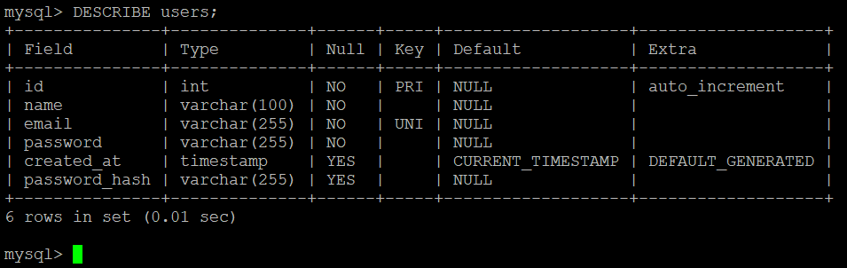
Внутри хеша: алгоритм (bcrypt), для которого нужно 60 символов, но стандарты меняются, поэтому берем 255 с запасом. Если установить лимит в 50 символов, хеш будет обрезан, что сделает проверку пароля невозможной и заблокирует вход для пользователей.

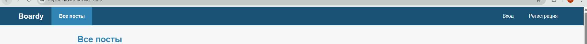
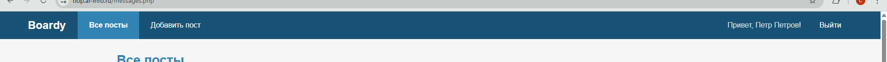
Вынос меню в partials/nav.php позволяет избежать дублирования кода и управлять навигацией из одного места для всех страниц сайта одновременно. Если добавить новую ссылку (Избранное), она появится на всех страницах проекта без необходимости править каждый файл вручную.

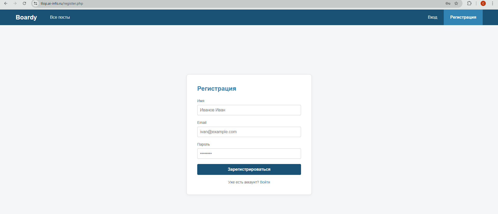
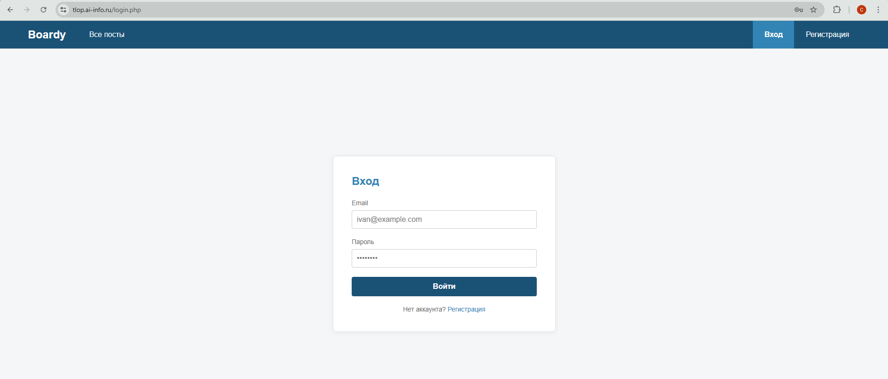
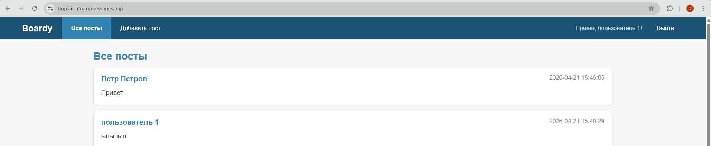

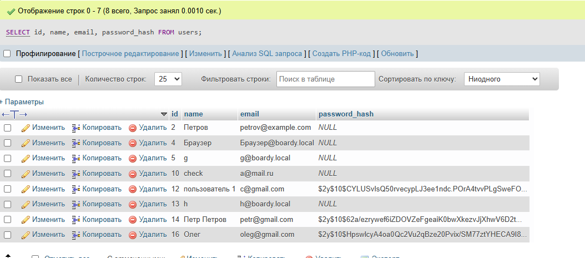
Внутри хеша: алгоритм ($2y$ = bcrypt), cost factor (10), соль (случайные данные), хеш. Увеличение параметра с 10 до 15 замедлит процесс хеширования (и проверки пароля) в 32 раза.

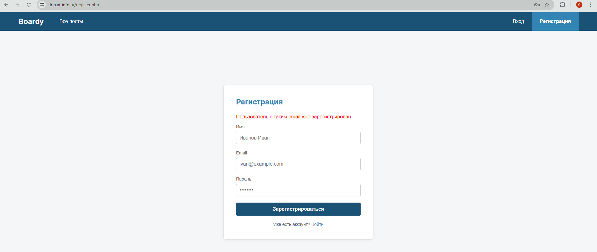
Зачем проверять email перед INSERT: Это гарантирует уникальность учетных записей, предотвращая создание дубликатов и путаницу при входе в систему, когда одному email соответствуют разные пароли.
Что произойдет без этой проверки: Если в базе нет ограничения UNIQUE на поле email, создастся два пользователя с одинаковой почтой; если ограничение есть - выполнение скрипта прервется с критической ошибкой базы данных (SQLSTATE[23000]), и пользователь увидит «белую страницу» вместо понятного уведомления.

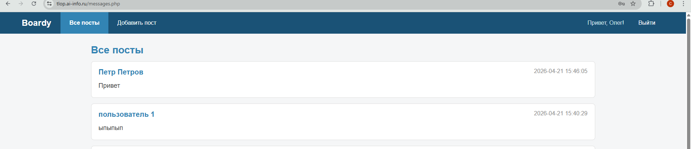
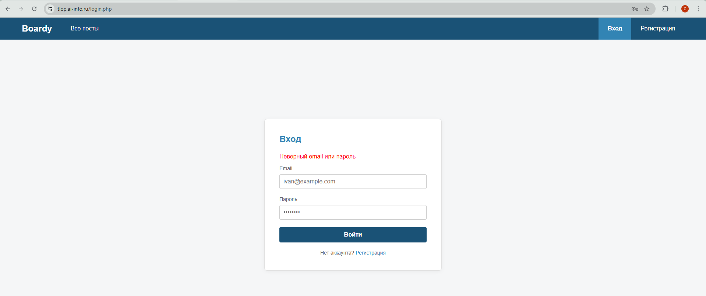
На login.php: для "email не найден" и "пароль неверный" - одно и то же сообщение. Иначе злоумышленник по разным сообщениям узнает, какие email зарегистрированы в системе.

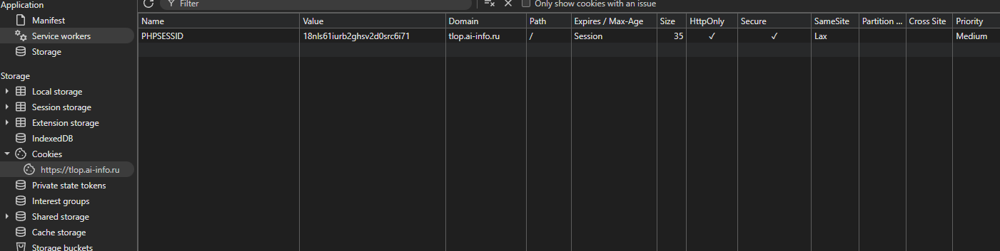
В куке хранится только уникальный идентификатор сессии. Значение генерируется автоматически интерпретатором PHP при вызове функции session_start().

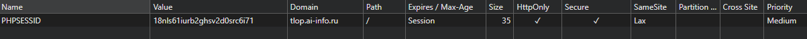
Если убрать флаг HttpOnly, кука сессии станет доступна для чтения и изменения обычным скриптам JavaScript, запущенным на странице (document.cookie). При XSS-атаке злоумышленник может внедрить на сайт вредоносный скрипт, который при загрузке страницы у пользователя украдет PHPSESSID и отправит его на сторонний сервер. Имея этот ID, хакер сможет подставить его в свой браузер и войти в аккаунт без пароля.

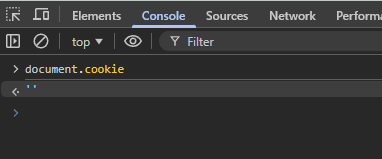
Кука скрыта от JavaScript, потому что для неё установлен флаг HttpOnly, который дает браузеру команду запретить доступ к этой переменной через программный интерфейс document.cookie.

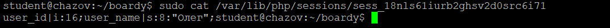
В куке (на клиенте): Хранится только случайный ID сессии, который сам по себе не несет полезной информации.
В файле (на сервере): Хранится массив данных сессии (например, user_id, user_name), которые PHP сохраняет для конкретного пользователя.
Такое разделение необходимо для безопасности и производительности: если хранить пароли или ID пользователя прямо в куке, злоумышленник сможет их подделать и зайти под чужим именем.

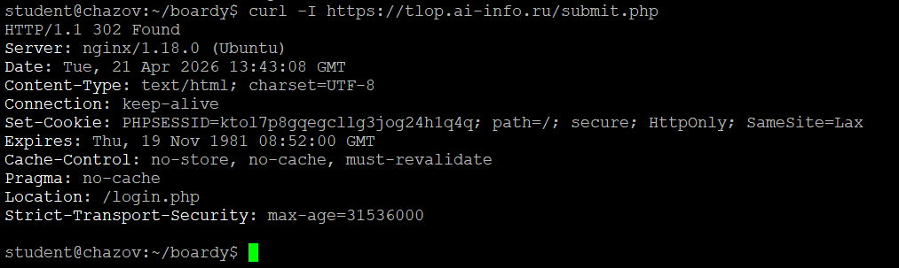
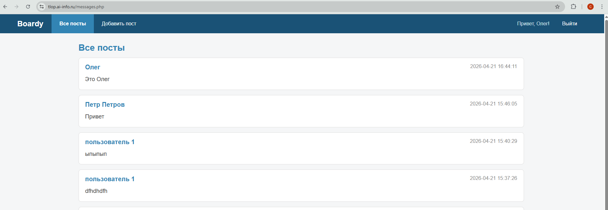
SELECT p.id, p.body, p.created_at, u.name AS author_name
FROM posts p
JOIN users u ON p.author_id = u.id
ORDER BY p.created_at DESC;
JOIN позволяет базе данных найти и объединить связанные строки за один запрос, что производительней.

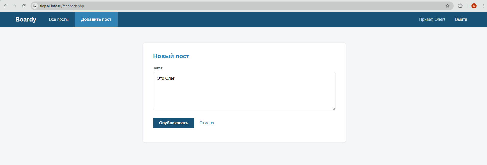
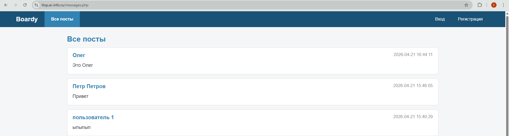
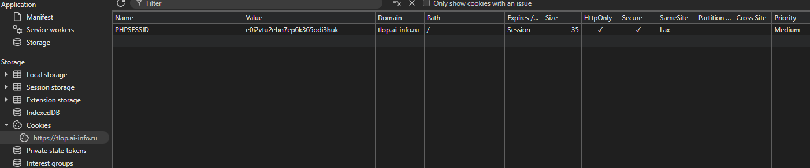
session_destroy() — удаляет данные сессии на сервере (файл).
setcookie(expires в прошлом) — браузер удалит куку.
Без setcookie — кука останется в браузере, укажет на несуществующий файл. Будет работать, но неаккуратно.
Без session_destroy — данные на сервере будут висеть до gc (24 минуты), кто-то может воссоздать куку вручную.

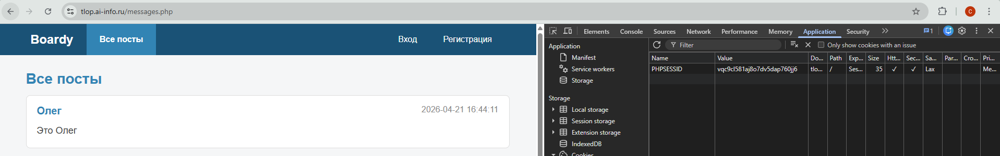
Браузер считает себя залогиненным, потому что в его памяти всё ещё хранится кука PHPSESSID, у которой не истёк срок жизни. Однако сервер при получении этой куки пытается найти соответствующий ей файл сессии в папке, и, не обнаружив его, считает сессию несуществующей.