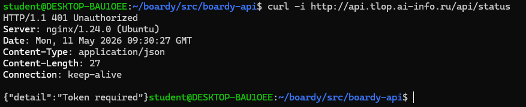
Bearer - это название схемы аутентификации, говорящее, что дальше идет токен доступа, который нужно проверить. Нельзя просто «Authorization: eyJ...», потому что заголовок Authorization - это контейнер. Серверу нужно знать, как именно интерпретировать идущую следом строку.

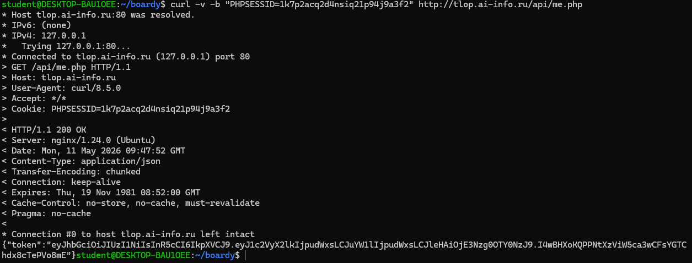
me.php использует сессию, чтобы подтвердить личность пользователя без повторного ввода пароля. Кука PHPSESSID служит ключом, по которому PHP находит данные пользователя на сервере, позволяя безопасно выдать JWT-токен.

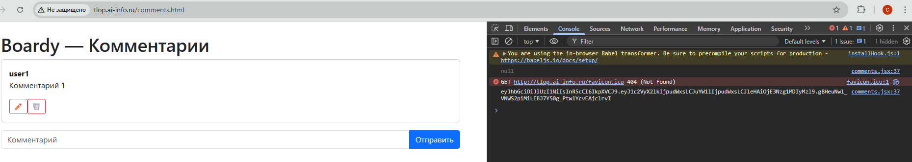
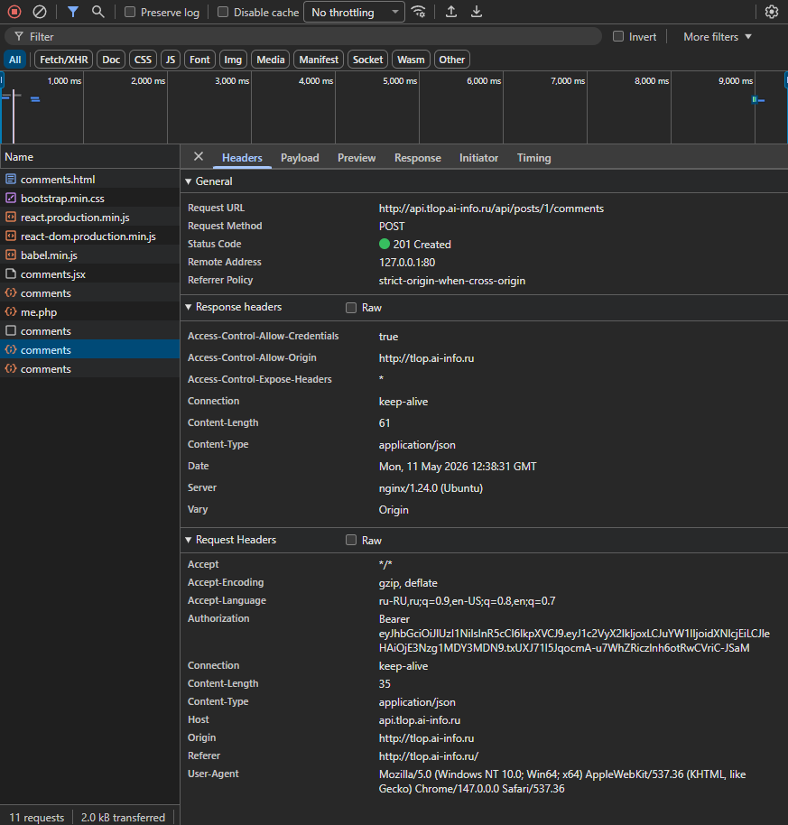
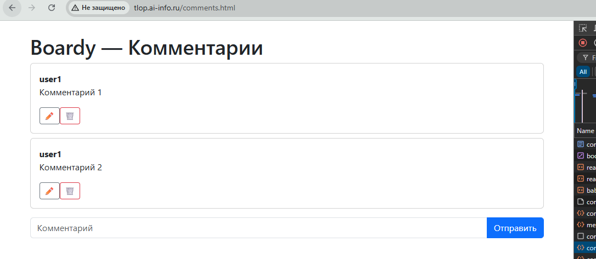

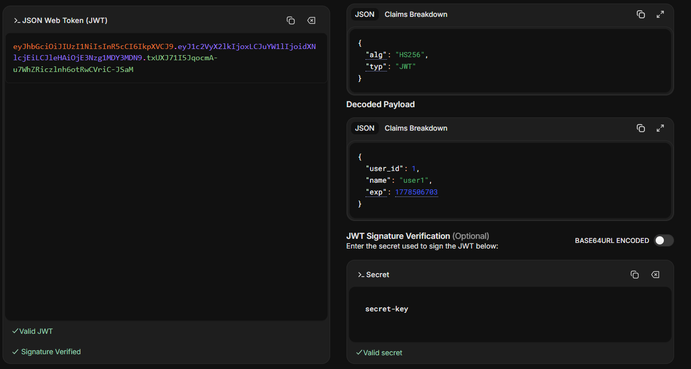
Данные в Payload закодированы, но не зашифрованы. Это значит, что любой человек, имеющий токен, может прочитать его содержимое, декодировав строку. Злоумышленник, перехвативший токен увидит всю информацию, хранящуюся в Payload. Это не является проблемой безопасности по двум причинам:данные можно прочитать, но их нельзя изменить; в JWT Payload по стандарту запрещено помещать конфиденциальные данные.

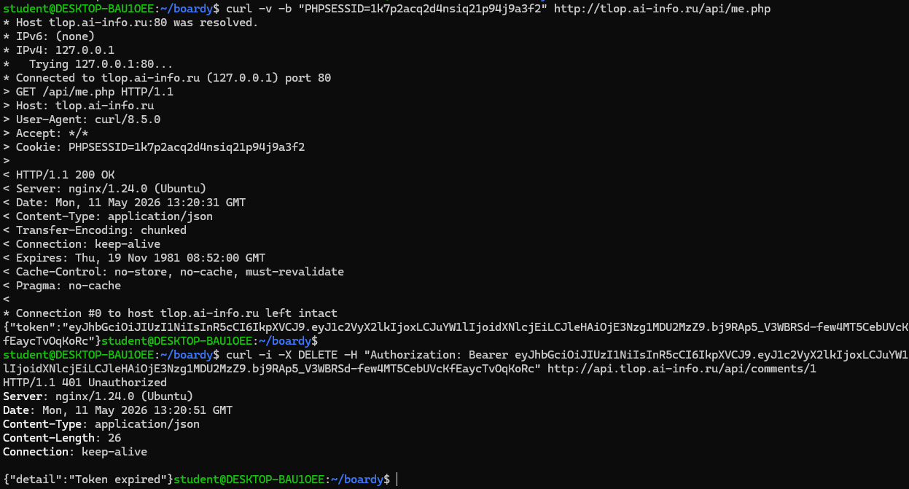
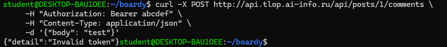
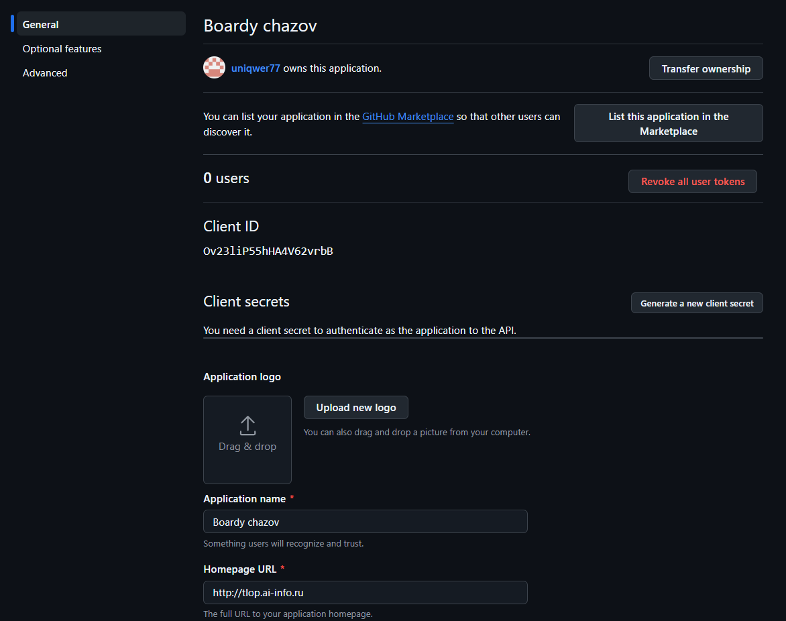
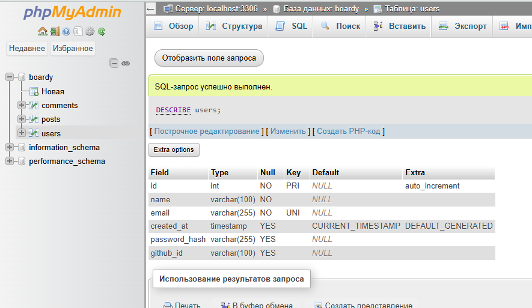
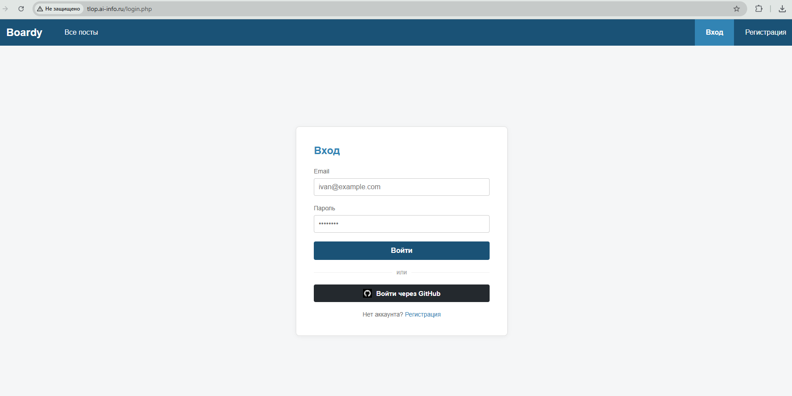
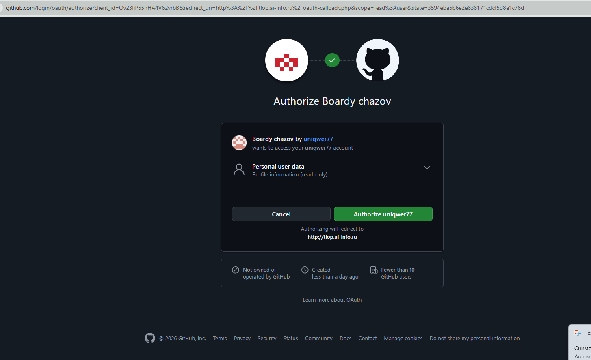
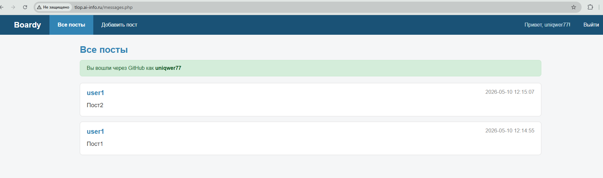

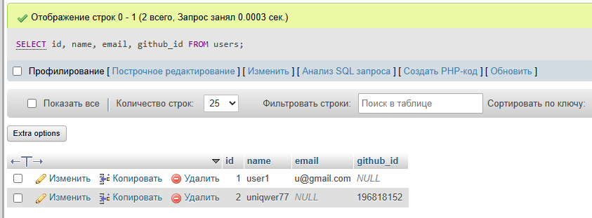
github_id - это уникальный и неизменяемый числовой идентификатор пользователя в системе GitHub. В то время как email пользователь может сменить в настройках профиля или скрыть его. Также при авторизации GitHub может не передать адрес электронной почты.

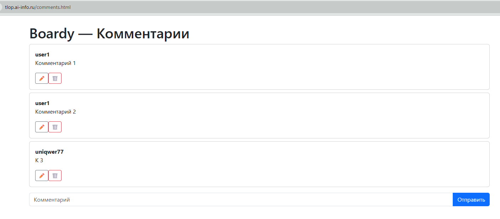
Сценарий OAuth через GitHub
Пользователь: кликает «Войти через GitHub»
oauth-github.php: 
1. state = random, $_SESSION['oauth_state'] = state 
2. Redirect → github.com/login/oauth/authorize?client_id=...&state=... 
GitHub: 
3. Показывает «Authorize Boardy» 
4. Пользователь нажал «Authorize» 
5. Redirect → oauth-callback.php?code=TEMP&state=random 
oauth-callback.php: 
6. Проверил state == $_SESSION['oauth_state'] (CSRF) 
7. POST github.com/login/oauth/access_token (сервер→сервер) code + client_id + client_secret → access_token 
8. GET api.github.com/user + Bearer access_token → profile 
9. SELECT WHERE github_id = profile['id'] → нет? INSERT. 
10. $_SESSION['user_id'] = $user['id'] 
11. Redirect → /messages.php 
Дальше: React → /api/me.php → JWT → fetch к FastAPI с Bearer

Задание 14.
State - это уникальная случайная строка (CSRF-токен), которую сервер приложения генерирует перед перенаправлением пользователя на GitHub и сохраняет в его сессии. Это «защитный пароль», который гарантирует, что ответ, пришедший на oauth-callback.php, инициирован именно вашим приложением, а не злоумышленником.
1. Злоумышленник начинает авторизацию через GitHub на сайте, но останавливается на этапе получения code (не дает браузеру завершить редирект на oauth-callback.php).
2. Злоумышленник копирует ссылку редиректа со своим рабочим кодом (например, boardy.ru/callback.php?code=HACKER_CODE).
3. Жертва (уже залогиненная на сайте) переходит по этой ссылке (через спам или вредоносный сайт).
4. Браузер жертвы переходит на oauth-callback.php. Так как проверки state нет, сервер приложения принимает HACKER_CODE, идет в GitHub и получает данные аккаунта злоумышленника.
5. Сессия жертвы в приложении Boardy «привязывается» к аккаунту GitHub злоумышленника. Теперь любые действия жертвы (например, публикация постов) будут происходить от имени злоумышленника, либо злоумышленник получит доступ к данным жертвы через связанный профиль.

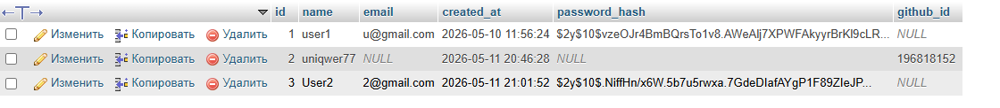

Задание 16. Сравнение механизмов
| Вопрос                     | Куки+сессии                      | JWT                                                     | OAuth                                  | 
| Где хранятся данные?       | На сервере, у клиента только ID  | В Payload на стороне клиента                            | На сервере провайдера                  | 
| Кто прикрепляет к запросу? | Браузер (автоматически)          | JS-код (вручную в заголовок Authorization)              | JS-код или сервер (через Access Token) | 
| Для какого типа клиентов?  | Браузеры                         | SPA, мобильные и десктоп приложения                     | Сторонние сервисы и интеграции         | 
| Можно ли отозвать?         | Да (удалением сессии на сервере) | Нет (пока не истечет срок exp), если нет черных списков | Да, через отзыв токена у провайдера    | 
| Кросс-доменно работает?    | Сложно                           | Да, без ограничений (передается в заголовке)            | Да                                     |

Задание 17
1. Секретный ключ в коде
 Если выложить код на GitHub, боты мгновенно найдут ключ. Злоумышленник сможет подделывать JWT-токены и заходить под любым ID.	
 Laravel Passport (генерирует RSA, хранит в файлах, .gitignore).
2. Отсутствие механизма отзыва токенов	
 Заблокировали пользователя — JWT час ещё действует.	
 Laravel Passport (таблица oauth_access_tokens, DELETE).
3. Отсутствие Refresh-токенов	
 Чтобы сессия была безопасной, JWT должен «жить» недолго. Без Refresh-токена пользователю придется логиниться заново, после истечения JWt.	
 Laravel Passport (refresh_token из коробки).