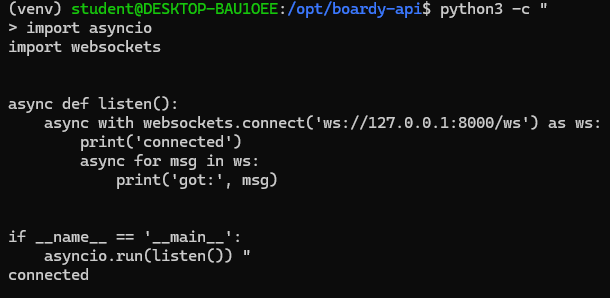
Почему self.active — список в памяти процесса, а не в базе данных? 
Скорость и производительность: WebSocket требуют мгновенной реакции для рассылки сообщений. Оперативная память работает гораздо быстрее, чем жесткий диск или сетевые запросы к БД.
Специфика данных: Список подключений — это временные данные. Нам нужно хранить живые TCP-соединения, которые привязаны к конкретному запущенному процессу.
Что произойдёт если Uvicorn перезапустится?
Список self.active_connections полностью очистится, так как оперативная память процесса сотрется; все текущие WebSocket-сессии с клиентами будут принудительно разорваны; На стороне клиентов сработает JavaScript-скрипт автореконнекта.

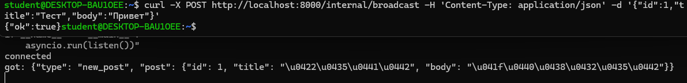
Эндпоинт /internal/broadcast не требует JWT-авторизации, так как предназначен для межсервисного взаимодействия внутри контура сети, где нет сущности пользователя. Главный риск заключается в том, что без защиты злоумышленник может вызвать этот эндпоинт напрямую из интернета и совершить несанкционированную массовую рассылку.

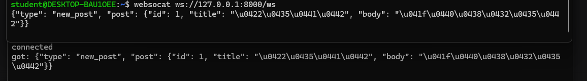
Если клиент отключается во время бродкаста, сервер получает ошибку записи в сокет, при этом рассылка остальным подписчикам продолжается без сбоев. Чтобы один «отвалившийся» клиент не ломал уведомления для всех остальных, в методе broadcast менеджера подключений используется блок try ... except внутри цикла. Если сокет мертв, возникает исключение, и выполнение сразу прыгает в блок except Exception:.

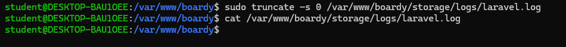
Ограничение timeout(2) (2 секунды) необходимо для защиты основного приложения от зависания: если FastAPI начнет отвечать слишком медленно, Laravel не будет бесконечно ждать ответа, а быстро прервет запрос. Если FastAPI окажется полностью недоступен, а таймаут не будет указан, сработает дефолтное ожидание PHP/cURL (обычно 60 секунд).

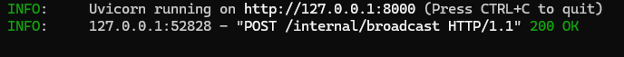
Синхронный HTTP-callback напрямую из метода store() называют костылем, потому что он жестко связывает два независимых сервиса, превращая распределенную систему в хрупкий монолит.
Три  проблемы этой архитектуры:
Падение производительности: Пользователь вынужден ждать, пока Laravel создаст пост, отправит HTTP-запрос в FastAPI, а тот его обработает. Даже с timeout(2) это критически замедляет ответ клиенту.
Каскадные сбои и потеря данных: Если FastAPI недоступен, Laravel выбросит исключение и прервет операцию (или проигнорирует ошибку), из-за чего данные в системах рассинхронизируются. Механизма автоматического повтора при таком подходе нет.
Плохая масштабируемость: При резком росте количества создаваемых постов Laravel начнет спамить FastAPI огромным количеством одновременных HTTP-запросов, что легко приведет к DoS-эффекту и падению принимающей стороны.

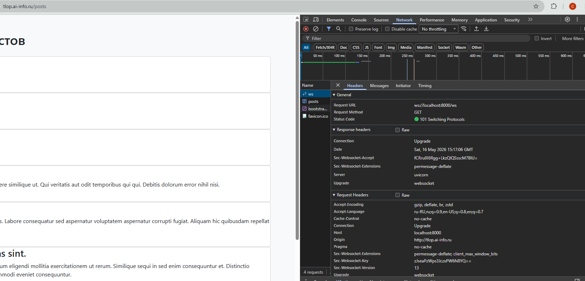
Разница между ws:// и wss:// заключается в наличии шифрования (TLS): на локальном компьютере (localhost) данные не выходят в сеть, поэтому используется незащищенный протокол ws://.
Если попытаться использовать wss:// без TLS-сертификата на сервере, соединение вообще не установится: браузер не сможет выполнить TLS-рукопожатие, получит ошибку проверки сертификата и сразу оборвет подключение, из-за чего веб-сокеты не заработают.

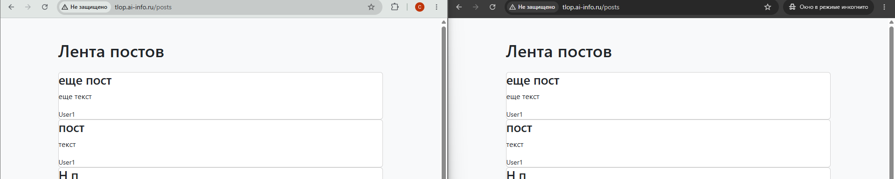
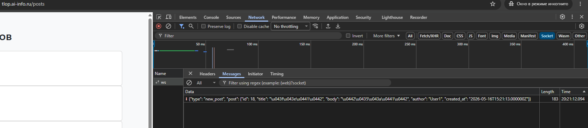

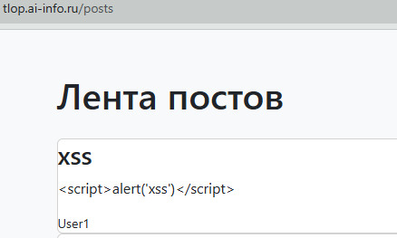
Функция escapeHtml() заменяет опасные спецсимволы HTML (например, <, >, &, ", ') на их безопасные текстовые аналоги (HTML-сущности вроде &lt; и &gt;), превращая исполняемый код в обычный текст. Если вставить пользовательские данные напрямую в innerHTML без такого экранирования, возникнет критическая уязвимость XSS (Cross-Site Scripting): браузер воспримет переданные строки как реальные теги и выполнит внедренный вредоносный JavaScript-код.

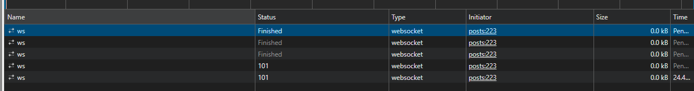
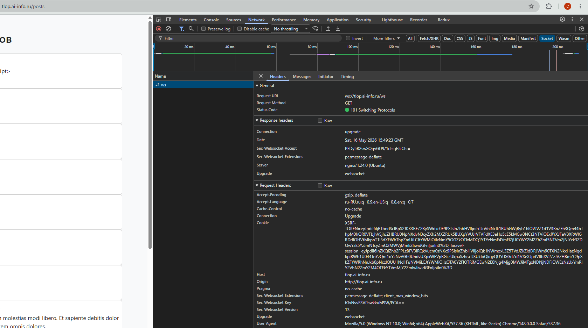
Без proxy_http_version 1.1 Nginx будет использовать устаревший протокол HTTP/1.0, который технически не поддерживает постоянные соединения и процедуру смены протокола. Если убрать proxy_set_header Upgrade, бэкенд не получит сигнал о переключении на WebSockets и обработает запрос как обычный HTTP, вернув ошибку. Если убрать proxy_read_timeout, Nginx применит дефолтный таймаут в 60 секунд, из-за чего при отсутствии сообщений соединение будет принудительно разрываться каждую минуту, заставляя клиента постоянно переподключаться.

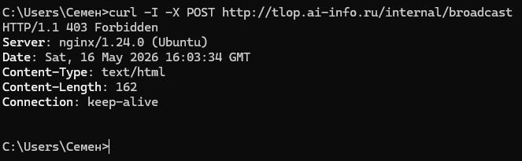
Эндпоинт /internal/broadcast без ограничения доступа опасен тем, что позволяет любому неавторизованному пользователю отправить вредоносную или спам-рассылку на все активные устройства, что приведет к перегрузке серверов (DoS). Вызвать его может кто угодно.