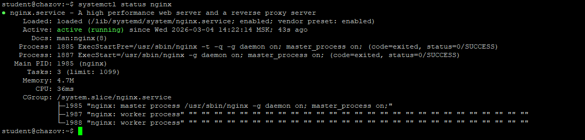
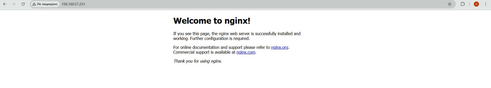
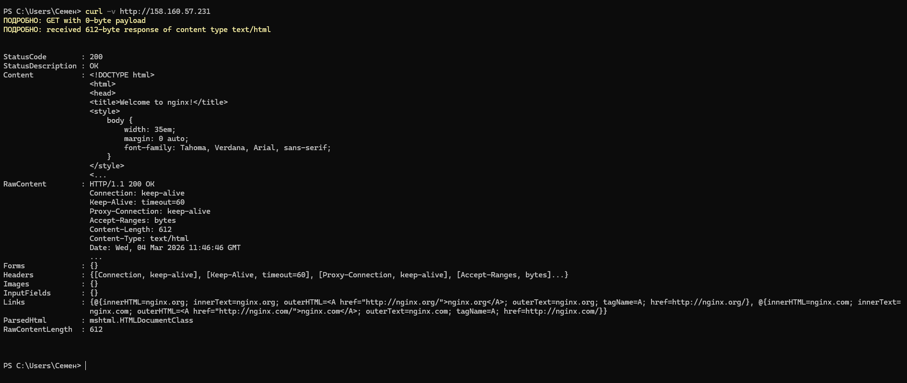
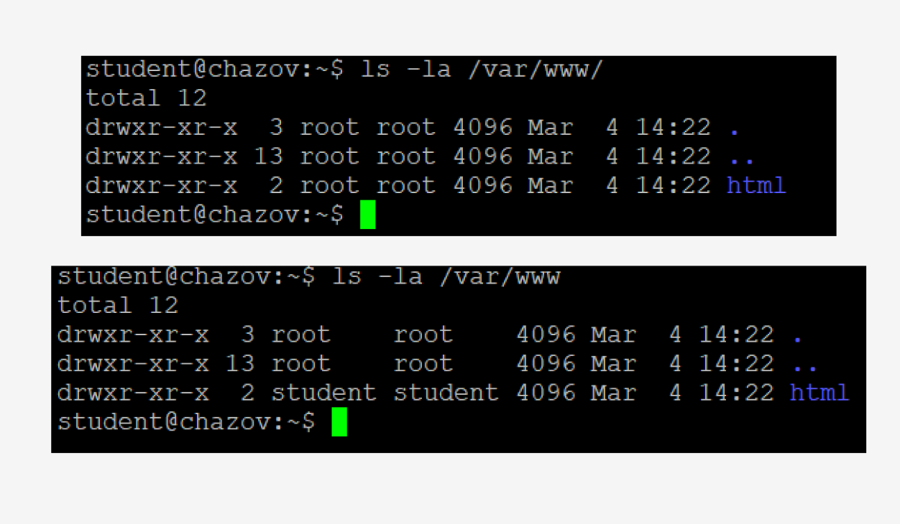
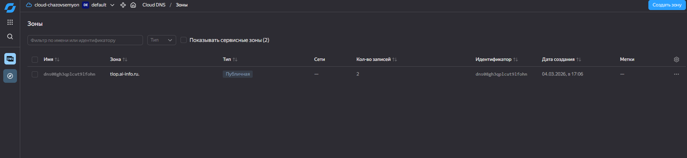
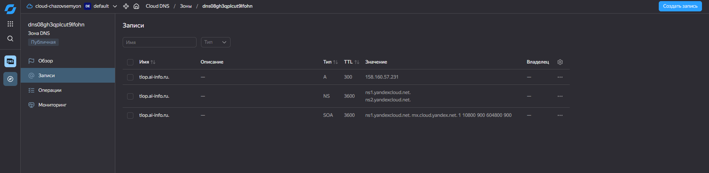
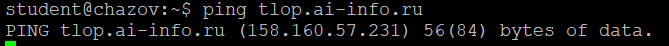
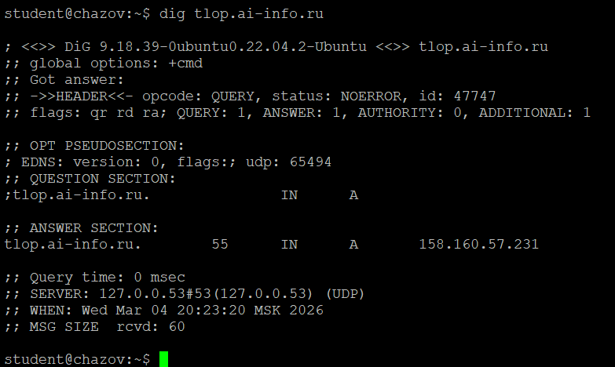
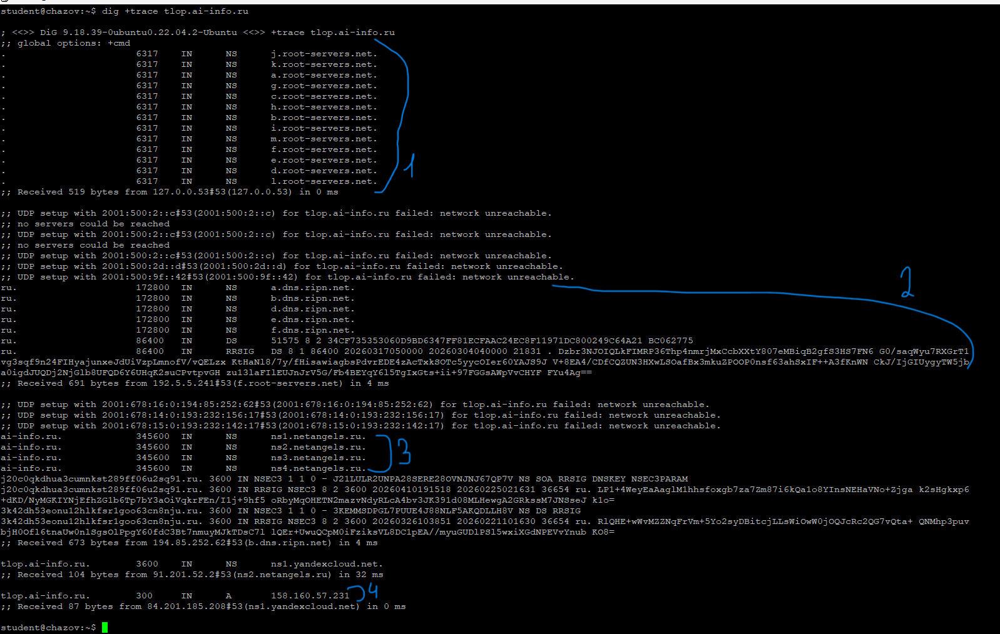
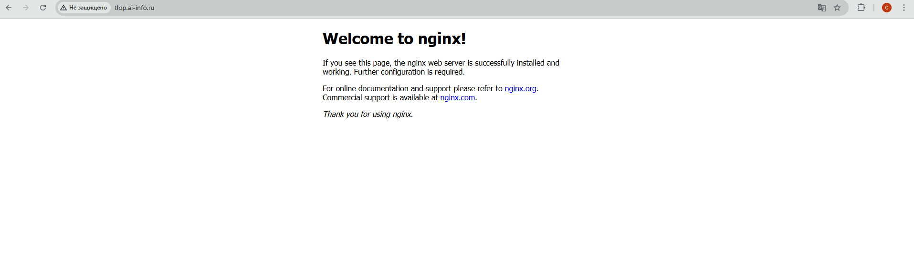

Строка запроса: GET / HTTP/1.1
Код ответа: 200 OK
Content-Type: text/html

listen: 80 default_server
IP-адрес и порт, на которых сервер будет принимать входящие соединения от пользователей

root: /var/www/html
Указывает путь к корневой директории в файловой системе сервера, где хранятся файлы веб-сайта

server_name: _
Используется для определения доменного имени сайта, а значение _ указывает серверу обрабатывать запросы, которые не подошли под другие специфические имена хостов

index: index.php index.html index.htm index.nginx-debian.html;
Устанавливает приоритетный список имен файлов, которые сервер будет искать и отдавать в качестве главной страницы при обращении к каталогу

QUESTION SECTION (что спросили): ;tlop.ai-info.ru.    IN    A
ANSWER SECTION (IP + TTL): tlop.ai-info.ru.    55    IN    A    158.160.57.231
SERVER (кто ответил): SERVER: 127.0.0.53#53(127.0.0.53) (UDP)

