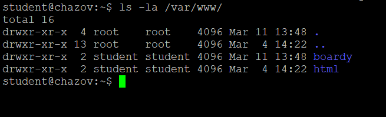

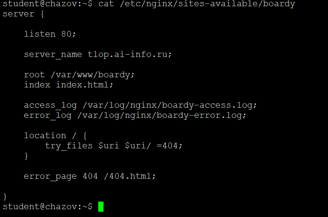
server_name - задаёт доменное имя, для которого данный блок сервера будет обрабатывать входящие запросы.
root - указывает путь к каталогу на сервере, где хранятся файлы сайта.
access_log - путь к файлу, в который Nginx записывает все обращения к сайту.
error_log - задаёт файл для записи ошибок, возникающих при обработке запросов.
try_files - проверяет существование файлов в указанном порядке и возвращает первый найденный; если ничего не найдено, выдаёт ошибку 404.
error_page - позволяет показать свою собственную страницу, когда посетитель попадает на несуществующую страницу сайта.

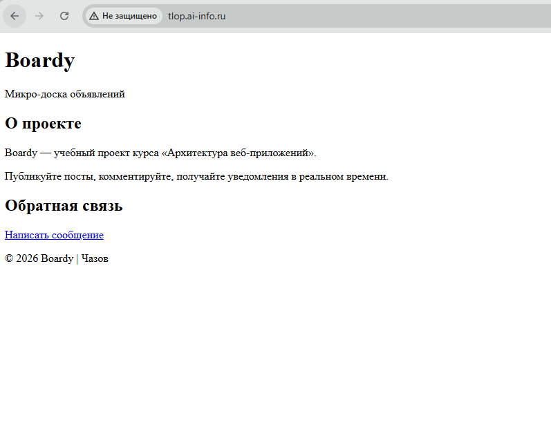
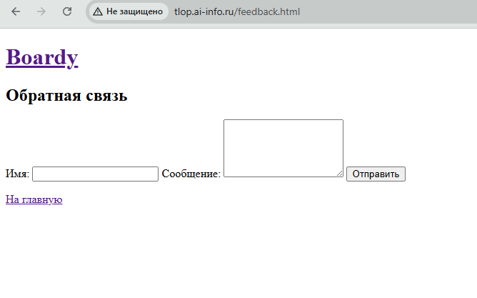

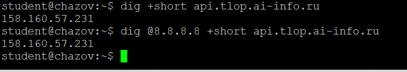
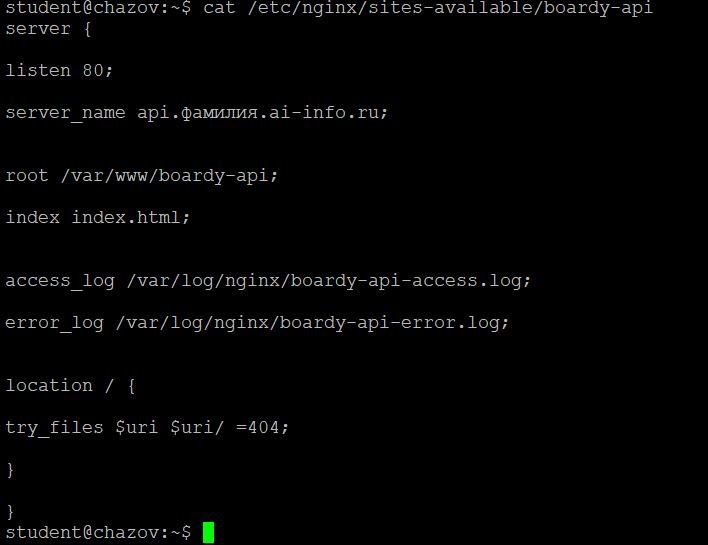

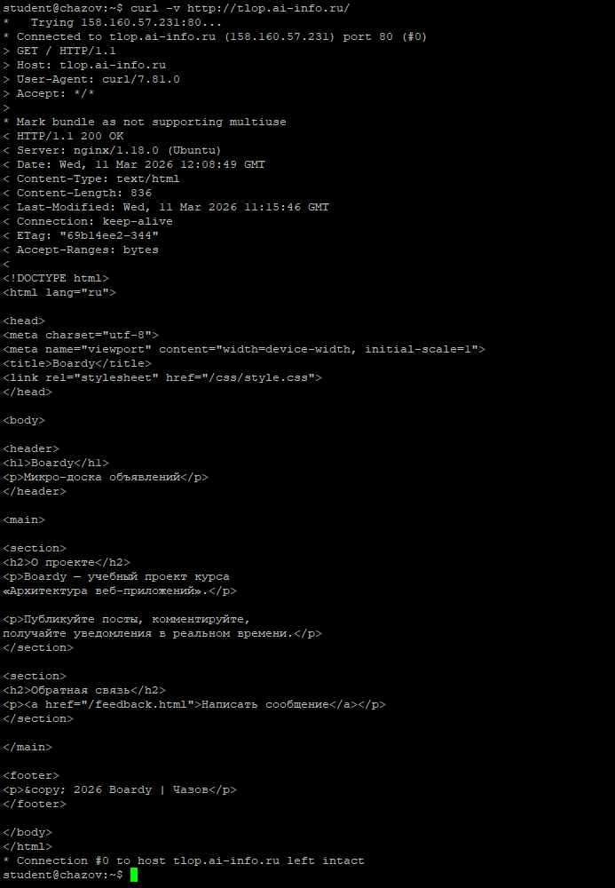
Стартовая строка запроса (метод, путь, версия): > GET / HTTP/1.1
Заголовок Host: > Host: tlop.ai-info.ru
Стартовая строка ответа (код и пояснение): < HTTP/1.1 200 OK
Content-Type: < Content-Type: text/html
Content-Length: < Content-Length: 836

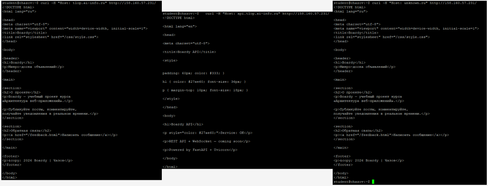
Один и тот же IP-адрес может обслуживать множество сайтов благодаря механизму виртуальных хостов в Nginx.
При получении HTTP-запроса Nginx читает Host, ищет server с подходящим server_name. Если совпадений нет, запрос обрабатывается сервером по умолчанию (default сервер).

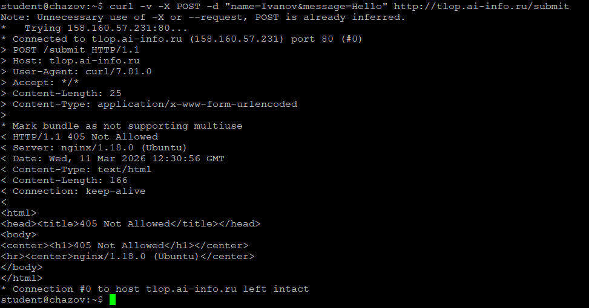
Метод запроса: POST /submit
Content-Type запроса: application/x-www-form-urlencoded
Тело запроса: name=Ivanov&message=Hello
Код ответа: 405 Not Allowed
Nginx вернул ошибку 405 Method Not Allowed, потому что по умолчанию Nginx не разрешает отправлять данные (POST) на статические файлы (Nginx не обрабатывает данные).

Ответ на HEAD отличается от GET отсутствием тела (body) ответа. HEAD нужен для проверки существования ресурса без его загрузки, узнать тип файла или размер, для проверки, изменился ли файл.

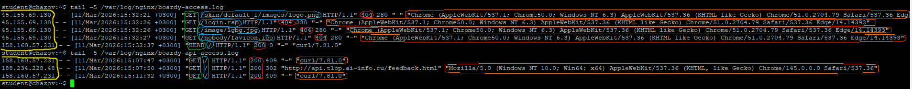
IP: желтый
Метод: зелёный
Путь: синий
Код ответа: красный
User-Agent: оранжевый

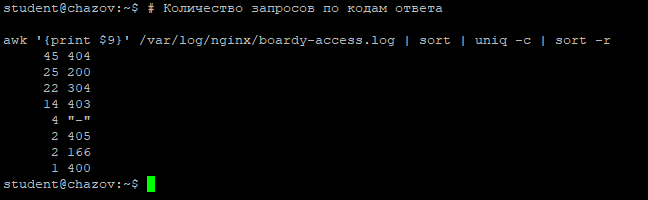
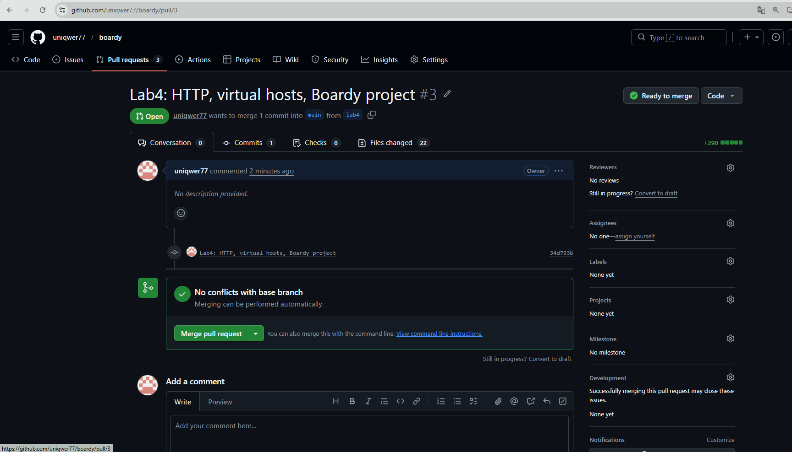
