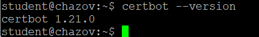
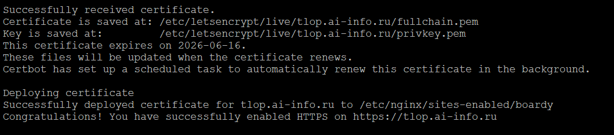
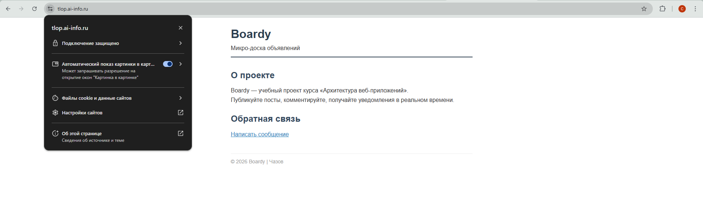
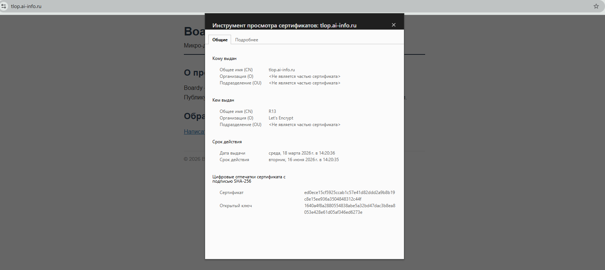
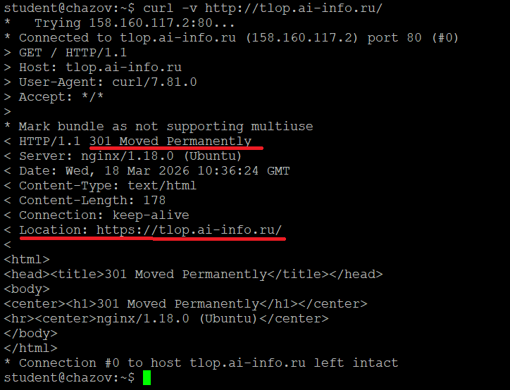
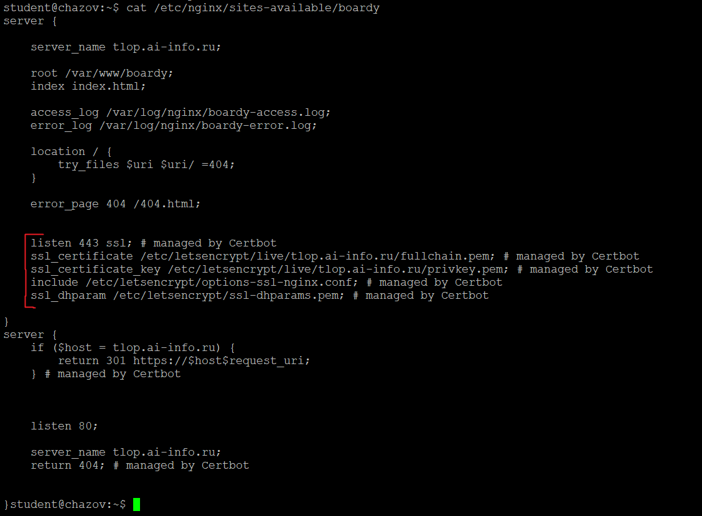
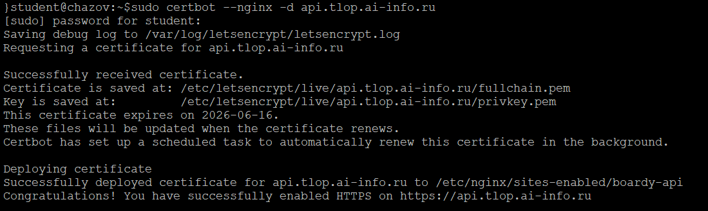
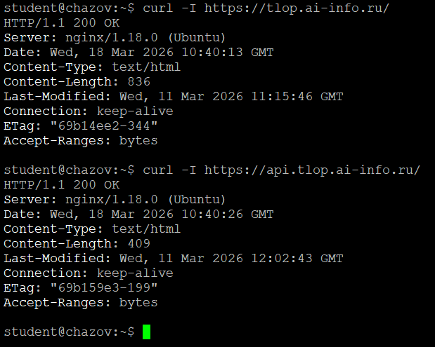

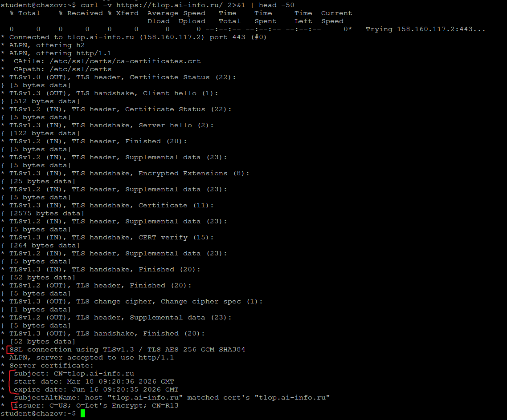
версию: TLS TLSv1.3
алгоритм шифрования: TLS_AES_256_GCM_SHA384
subject: CN=tlop.ai-info.ru
issuer: C=US; O=Let's Encrypt; CN=R13
срок действия: start date: Mar 18 09:20:36 2026 GMT expire date: Jun 16 09:20:35 2026 GMT

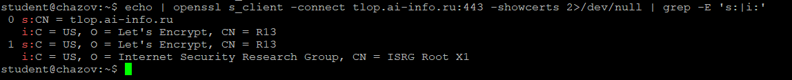
Цепочка доверия:
tlop.ai-info.ru → промежуточный Let's Encrypt R13 → корневой ISRG Root X1 (Internet Security Research Group)
Браузер получает от сервера сертификат сайта и промежуточные сертификаты, затем выстраивает цепочку до доверенного корневого сертификата из своего хранилища. Далее он последовательно проверяет цифровые подписи каждого сертификата в цепочке с использованием открытого ключа следующего сертификата, а также контролирует срок действия и соответствие имени домена.

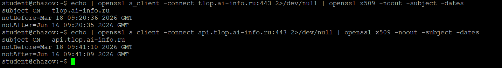
Сравнение сертификатов 
Общее: издатель(issuer), срок действия, алгоритм и тип
Различия: Common Name(CN) tlop.ai-info.ru и api.tlop.ai-info.ru, точные даты начала и окончания
Это два отдельных сертификата, каждый для своего поддомена

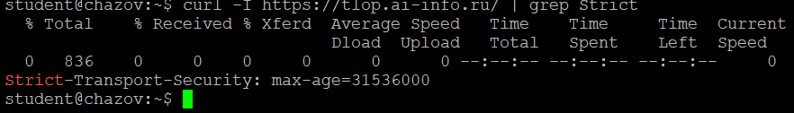
HSTS (HTTP Strict Transport Security) - это механизм безопасности, который заставляет браузер взаимодействовать с сайтом только по HTTPS, автоматически преобразуя все HTTP-ссылки в HTTPS ещё до отправки запроса. Он защищает от атак типа SSL stripping (понижение протокола до незащищённого HTTP) и предотвращает перехват конфиденциальных данных, включая cookie, через незашифрованные соединения.

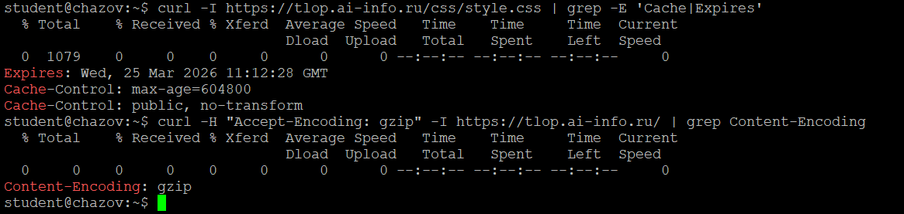
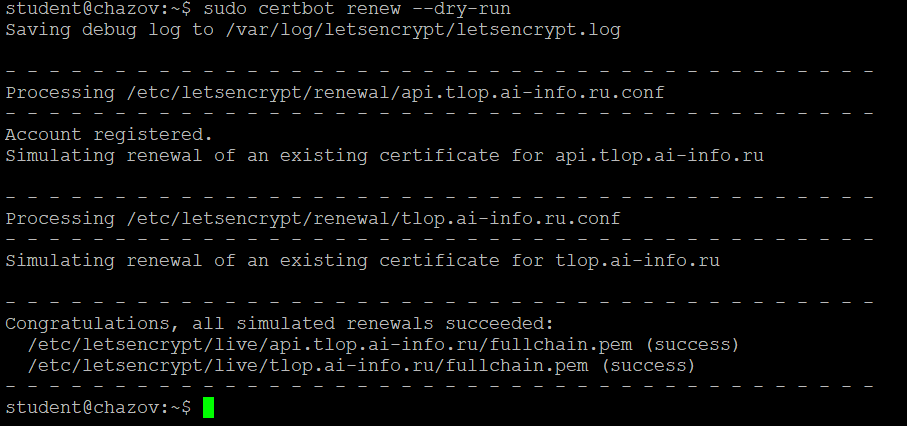
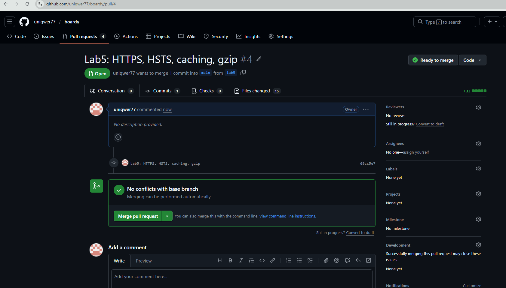
