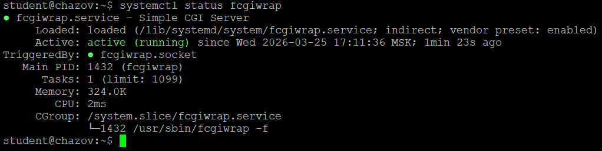
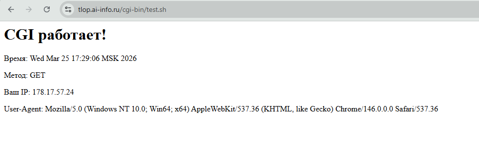
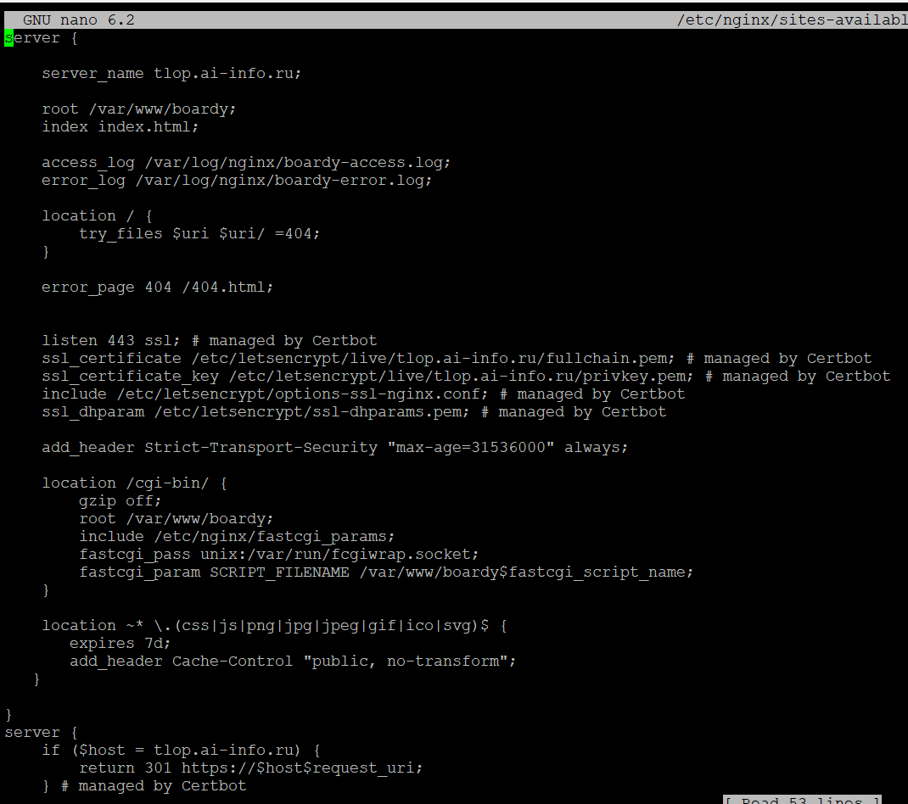
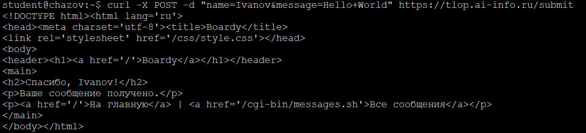
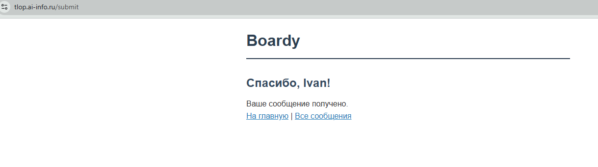
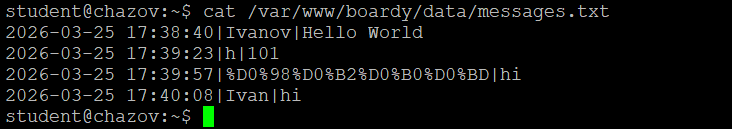
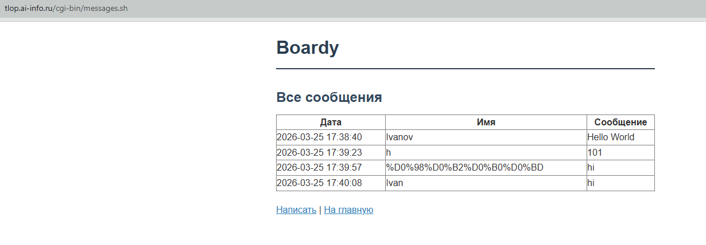
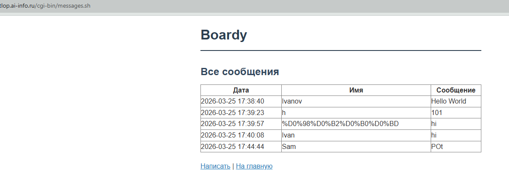
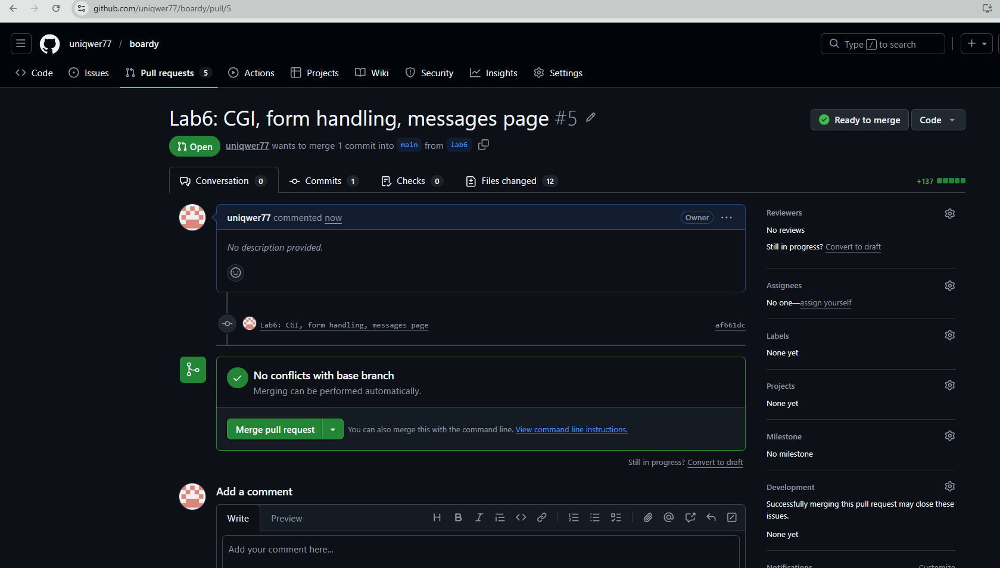

fastcgi_pass - Указывает, куда передавать запрос для обработки FastCGI-скриптов
include fastcgi_params - Подключает стандартный файл с базовыми FastCGI-параметрами
SCRIPT_FILENAME - Передает FastCGI-серверу полный путь к исполняемому файлу скрипта

Браузер → HTTPS (зашифрованный HTTP-запрос) → Nginx → FastCGI (передача запроса) → fcgiwrap (обёртка для CGI) → 
submit.sh (скрипт обработки) → stdin (данные формы) → messages.txt (запись сообщения) → stdout (ответ скрипта) → Nginx → Браузер

1. CGI (Common Gateway Interface - общий интерфейс шлюза) — это стандарт взаимодействия веб-сервера с внешними программами, разработанный в 1993 году. Он решил проблему статического веба, позволив создавать динамический контент: сервер мог запускать скрипт (например, на Perl или C) для обработки запроса пользователя и генерации уникальной HTML-страницы «на лету». 
2. CGI-скрипт получает данные POST-запроса через стандартный ввод (stdin). Веб-сервер передает тело запроса в stdin скрипта, а длину данных указывает в переменной окружения CONTENT_LENGTH. Также в CONTENT_TYPE передается тип данных, чтобы скрипт знал, как интерпретировать полученные данные.
3. CGI создает проблемы при высокой нагрузке, так как для каждого входящего запроса сервер вынужден создавать новый отдельный процесс, а затем закрывать его. Это приводит к чрезмерному потреблению ресурсов CPU и оперативной памяти, замедляя обработку запросов и вызывая зависания сервера при росте трафика. 
4. fastcgi_pass используется для перенаправления запросов на FastCGI-серверы, которые запускают приложения, построенные с использованием различных фреймворков и языков программирования, например PHP. С помощью этой директивы можно указать адрес FastCGI-сервера, который может быть представлен в виде доменного имени или IP-адреса и порта. 
proxy_pass применяется, когда нужно перенаправить запрос другой службе или другому серверу в сети. Директива задаёт протокол и адрес проксируемого сервера.
Таким образом, fastcgipass используется для работы с приложениями, использующими протокол FastCGI, а proxypass — для более общего перенаправления запросов.
5. Fcgiwrap нужен, потому что Nginx не поддерживает CGI напрямую, но может вызывать скрипты с помощью протокола FastCGI. Этот подход позволяет Nginx эффективно обрабатывать запросы CGI, сохраняя преимущества архитектуры сервера. 

