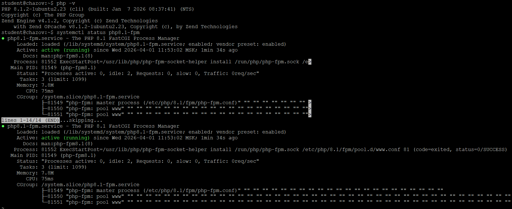

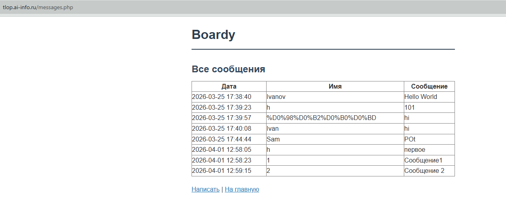

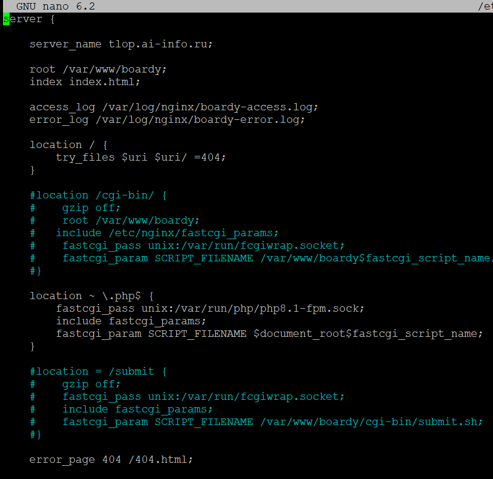
fastcgi_pass — это директива Nginx для отправки запросов работающему FastCGI-серверу, а fcgiwrap — это обертка, превращающая классический CGI-скрипт в FastCGI-процесс. PHP-FPM быстрее, так как держит интерпретатор PHP в памяти, а fcgiwrap запускает новый процесс для каждого запроса.

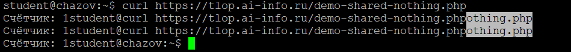
Это происходит потому, что PHP работает по принципу Shared Nothing (отсутствие разделяемых ресурсов). Каждый раз, когда поступает HTTP-запрос, интерпретатор запускает скрипт «с чистого листа»(выделяется новая память, переменные инициализируются заново, после завершения работы скрипта вся память очищается)
Shared Nothing — это архитектура веб-приложения, при которой каждый запрос обрабатывается в полной изоляции. У процессов нет общей оперативной памяти или общих переменных.

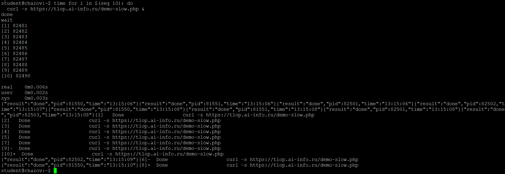
Реальное время выполнения составило 4-5 секунд. На сервере 5 воркеров PHP-FPM. Поскольку воркеров вдвое меньше, чем запросов, сервер выполнил их в две очереди

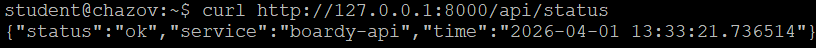
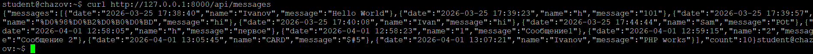

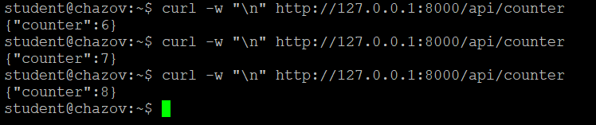
FastAPI работает как постоянно запущенный сервис. Глобальные переменные инициализируются один раз при старте сервера. Когда приходит запрос, FastAPI просто вызывает функцию внутри уже работающего процесса. Функция меняет значение переменной прямо в оперативной памяти, которая не очищается после завершения запроса.

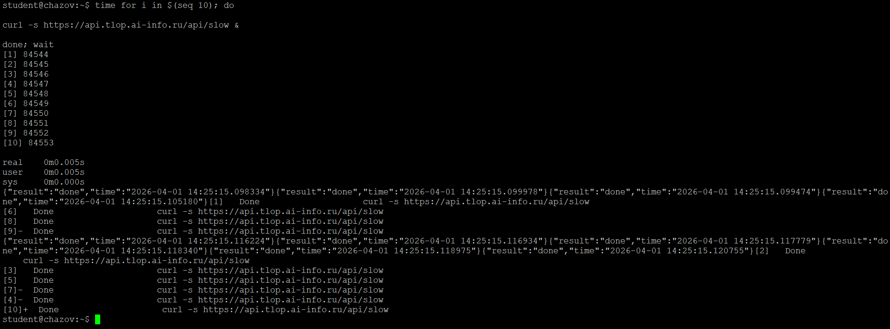
В отличие от PHP-FPM, где каждый запрос жестко блокирует отдельный процесс, FastAPI работает на базе Event Loop(цикла событий).
Время выполнения составило ~2 секунды, потому что запросы обрабатывались параллельно(команда curl ... & запускает 10 процессов в фоновом режиме одновременно) и конкурентно (сервер не ждет завершения первого запроса, чтобы принять второй, он берёт все 10 запросов в работу), не блокируя друг друга.

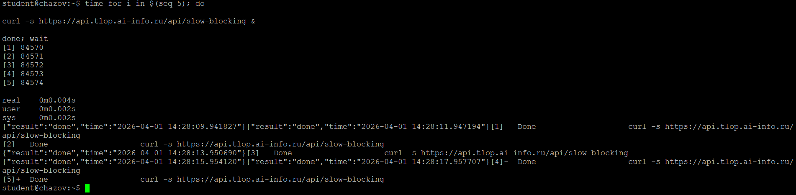
/api/slow - асинхронный, а /api/slow-blocking - синхронный. Во втором случае: сервер не может взять второй запрос, пока не закончит первый, поэтому запросы выстраиваются в очередь.

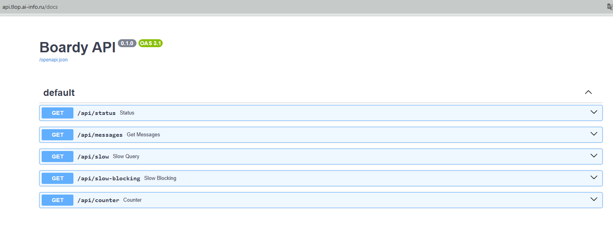
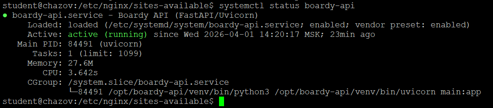

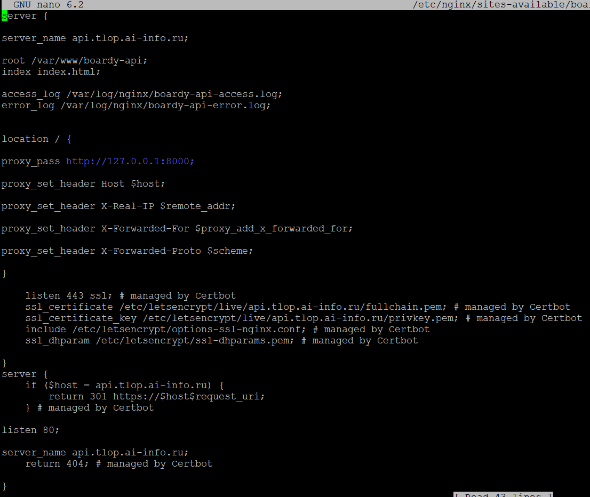
fastcgi_pass нужен там, где бэкенд не понимает HTTP напрямую (PHP), nginx принимает HTTP-запрос от пользователя, переводит его на язык FastCGI и передает в PHP-FPM
А proxy_pass используется, когда бэкенд сам является веб-сервером (FastAPI + Uvicorn) и нам нужно просто передать ему запрос без изменений.

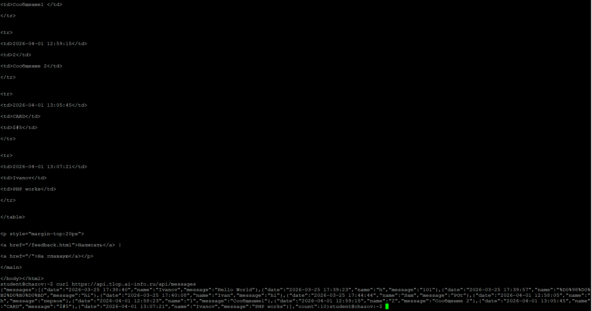
HTML (из messages.php) - это представление данных. В ответ включена не только информация, но и инструкции о том, как она должна выглядеть (жирный шрифт, таблицы, цвета). HTML для человека (браузер)
JSON (из /api/messages) - это чистые данные. Здесь нет информации о дизайне, только сама суть сообщений в структурированном виде. JSON для программ.

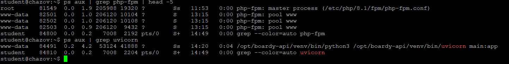
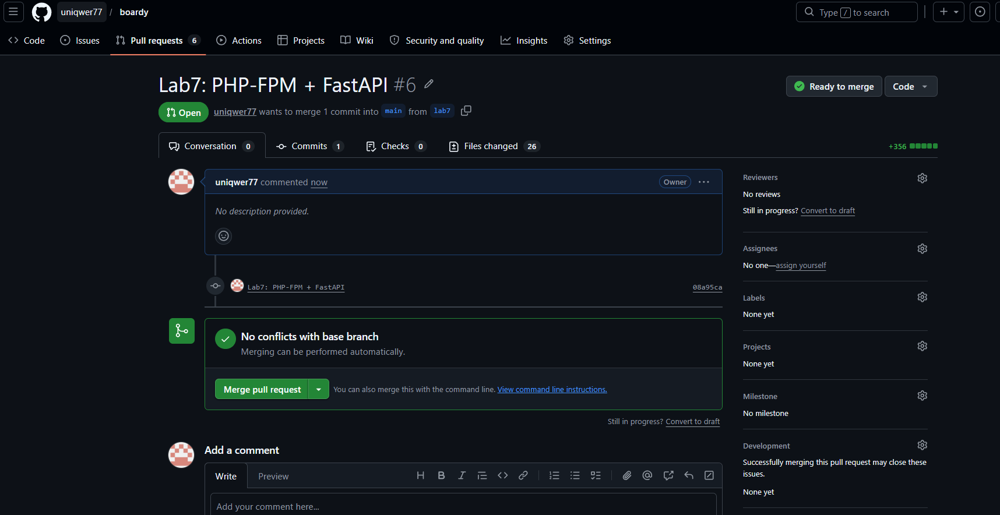
