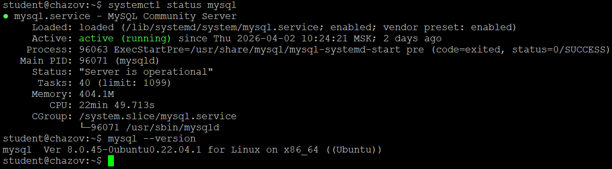

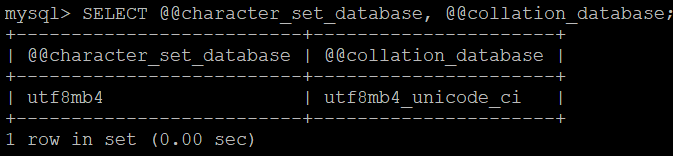
utf8 в MySQL — исторический костыль, поддерживает только 3 байта (нет эмодзи). utf8mb4 — настоящий UTF-8.
Кодировка (charset) — какие символы можно хранить. Collation — как их сравнивать и сортировать.
unicode_ci значит, что используется официальный алгоритм стандарта Unicode для сортировки, который нечувствителен к регистру.

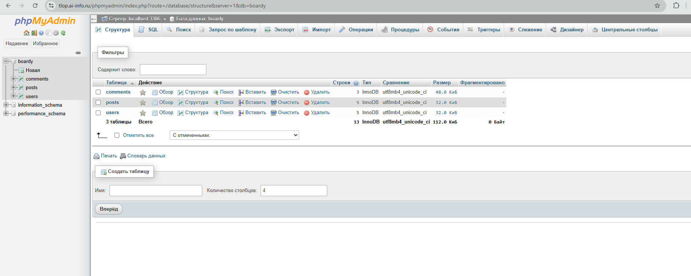
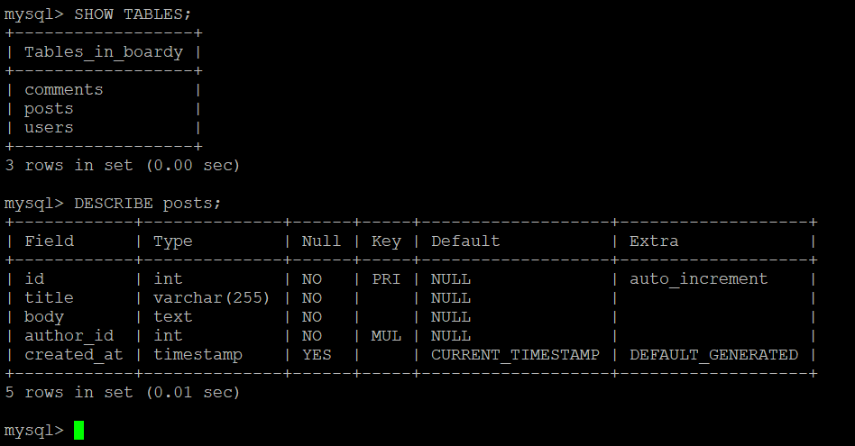

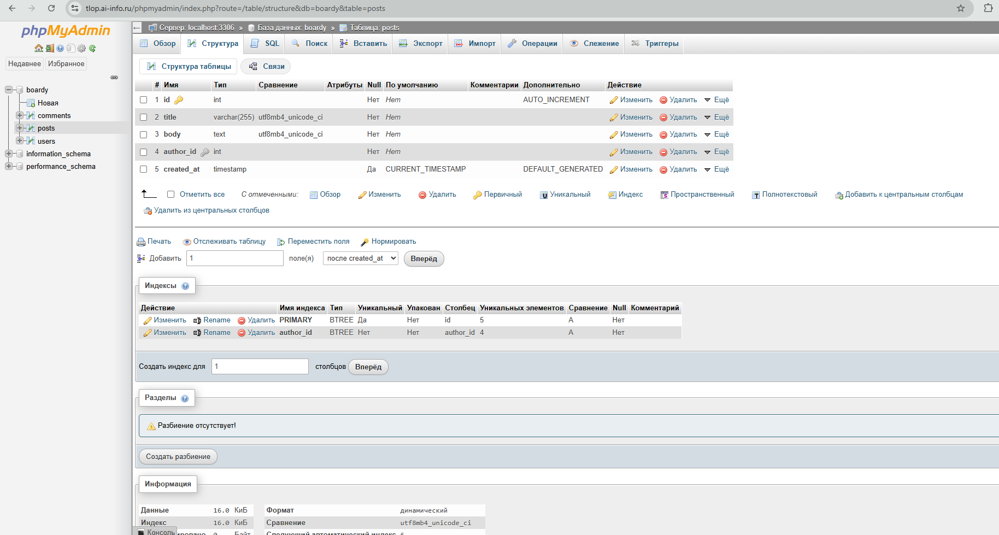
FOREIGN KEY - это связь между таблицами, которая гарантирует, что в базе не появится «мусорных» записей с несуществующими ID.
ON DELETE CASCADE - это правило автоматической очистки: если вы удалите пользователя, база сама мгновенно удалит все его посты и комментарии.
Движок InnoDB используется потому, что только он в MySQL полноценно поддерживает эти связи (внешние ключи) и обеспечивает надежность данных при сбоях.

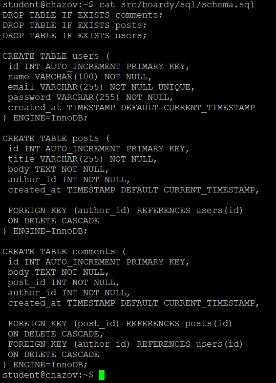
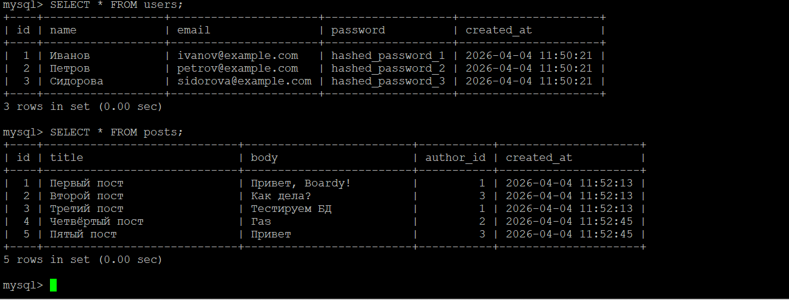
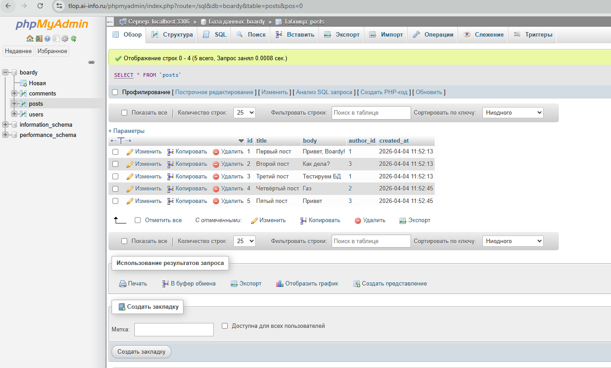

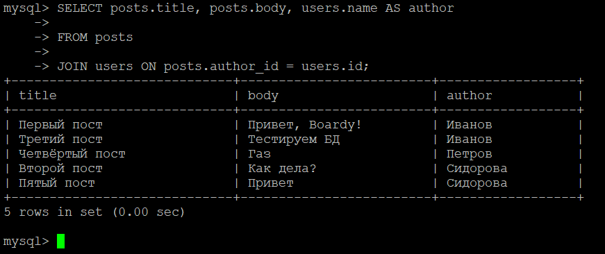
JOIN используется для объединения данных из нескольких таблиц в одном запросе.
Без использования JOIN получить имя автора можно двумя отдельными запросами: сначала выбрать пост, а затем вторым запросом найти имя пользователя по полученному ID. Это медленно и создает лишнюю нагрузку на сервер.

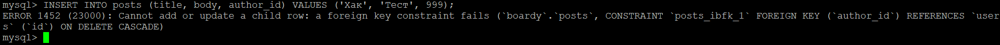
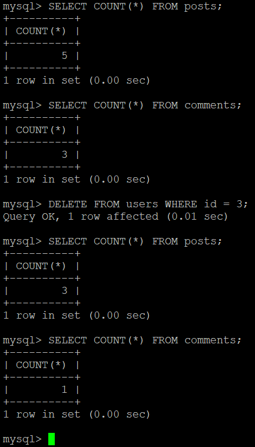

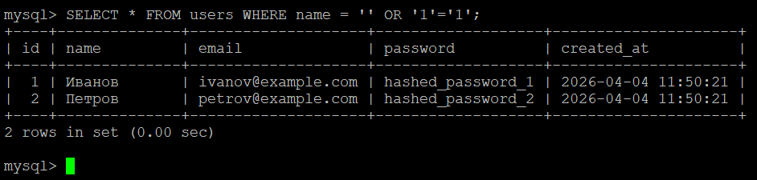
SQL-инъекция - это метод взлома, при котором вредоносный SQL-код внедряется в поля ввода, изменяя логику запроса к базе данных. Это происходит из-за прямой конкатенации строк, когда данные пользователя смешиваются с кодом SQL. Prepared Statements (подготовленные запросы) защищают, разделяя структуру SQL-запроса и данные, отправляя их в БД по отдельности.

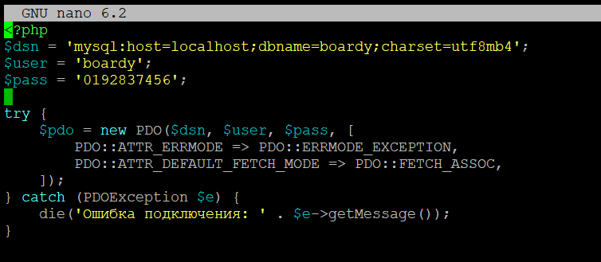
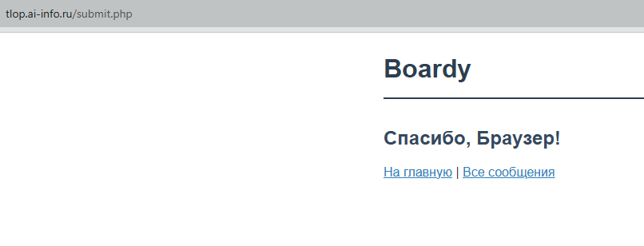
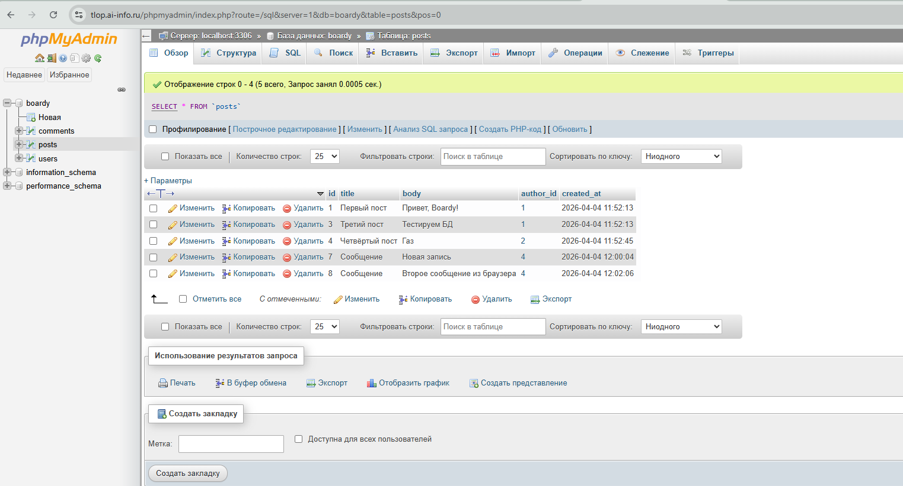
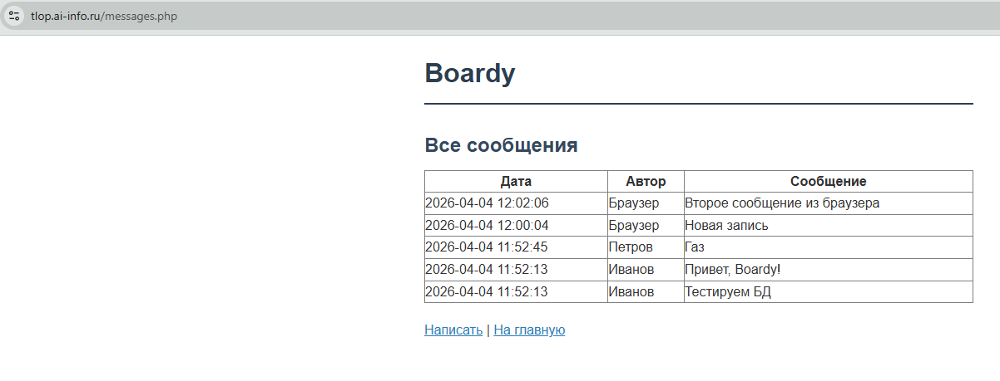
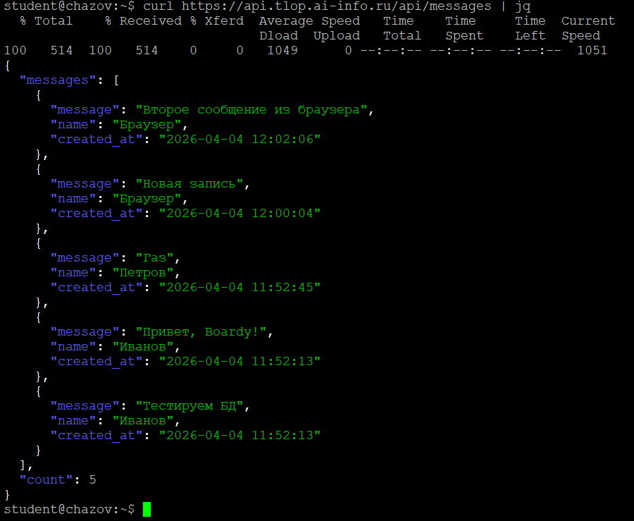
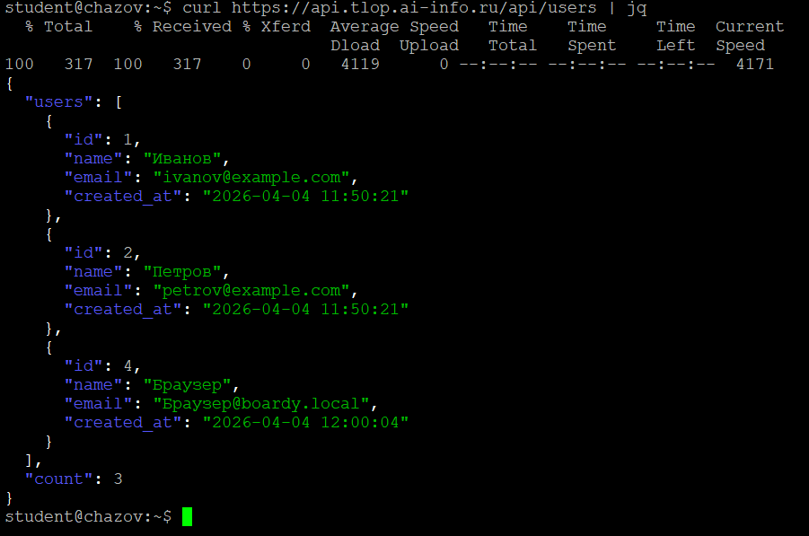

aiomysql - асинхронный драйвер MySQL. await — не блокирует event loop при запросе к БД. Обычный mysql-connector заблокировал бы, как например time.sleep

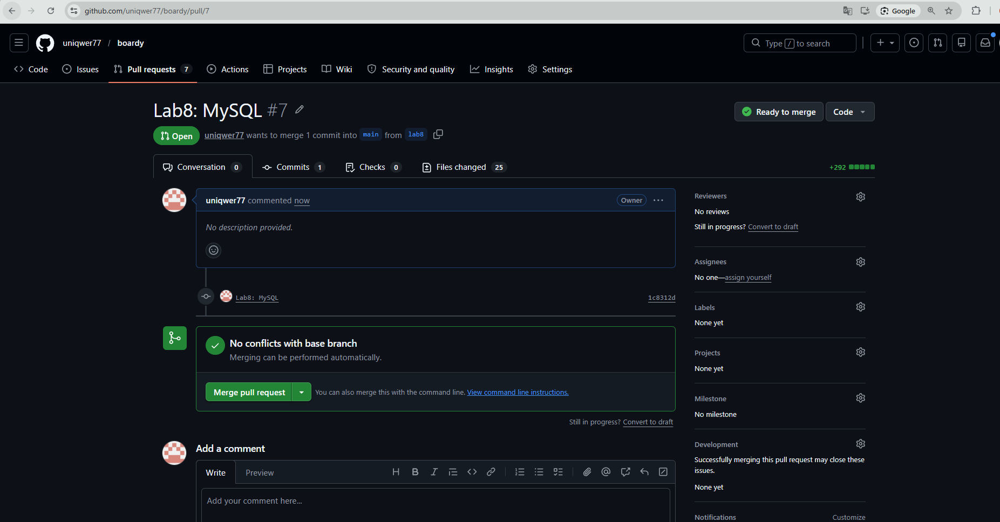
