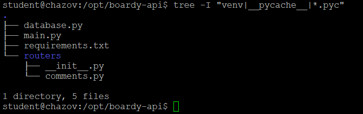

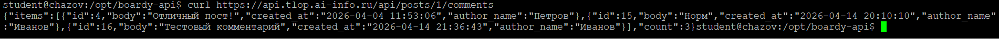
SELECT c.id, c.body, c.created_at, u.name AS author_name
FROM comments c
JOIN users u ON c.author_id = u.id
WHERE c.post_id = 1
ORDER BY c.created_at
JOIN связывает две таблицы по внешнему ключу (author_id и users.id)

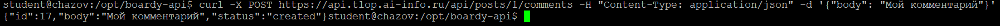
Ответ 200 - успешно. Используется для GET, PUT, DELETE.
Ответ 200 - создано. Используется для POST.
Заголовок Content-Type сообщает серверу, в каком формате отправлены данные в теле запроса. application/json значит, что тело запроса содержит JSON.

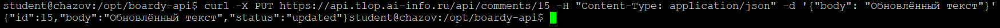
POST - это создание нового комментария, обращаемся к комментариям у поста с каким-то id.
PUT - это обновление комментария, обращаемся к конкретному комментарию по его id.

GET - получение данных, ответ 200 OK.
POST - создание ресурса, ответ 201 Created(создано).
PUT - обновление ресурса, ответ 200 OK.
DELETE - удаление ресурса, ответ 204 No Content(нет данных для возврата).

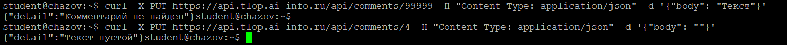
404 Not Found - ресурс отсутствует в БД.
422 Unprocessable Entity - данные некорректны.

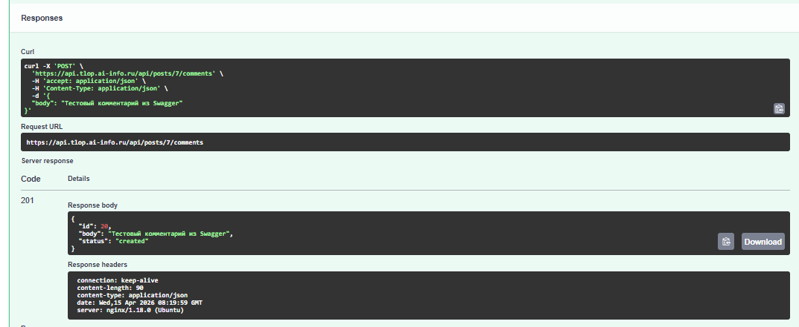
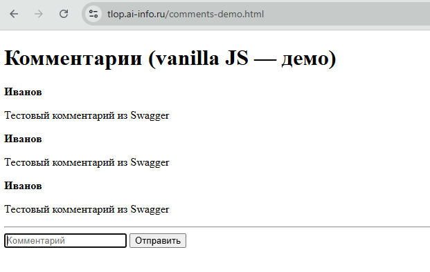
Функция esc() экранирует опасные HTML-символы, превращая их в безопасные HTML-сущности. Это защита от XSS-атак. Без esc() злоумышленник может вставить код, который выполнится в браузерах других пользователей, что может привести к кража паролей, перехвату сессий, подмене содержимого страницы.

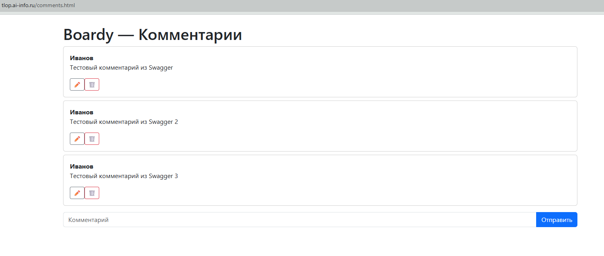
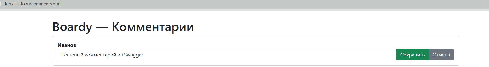
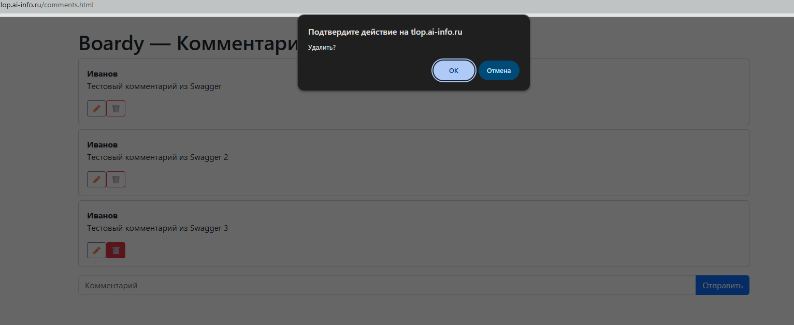

Задание 10.
1) vanilla JS - переменные + DOM, React - хуки useState
2) vanilla JS - руками через innerHTML, React - автоматически перерисовывается после изменения state
3) vanilla JS - пришлось бы хранить editId и editText в переменных и скрывать, показывать элементы через style.display или через изменение innerHTML, React - храним editId и editText в стейтах, для переключения используется условный рендеринг.
4) vanilla JS - ручное экранирование через esc(), React - автоматическое экранирование

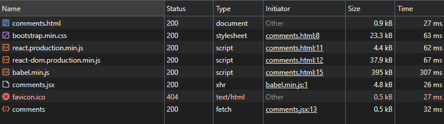
5 запросов, к API пятый запрос fetch comments.jsx:13.

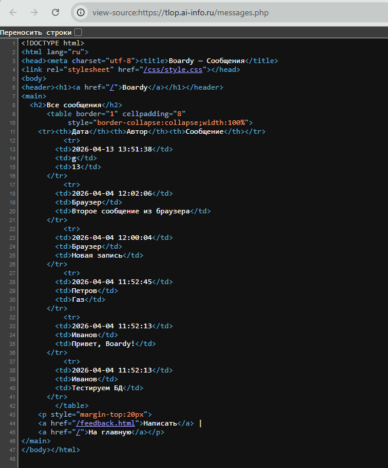
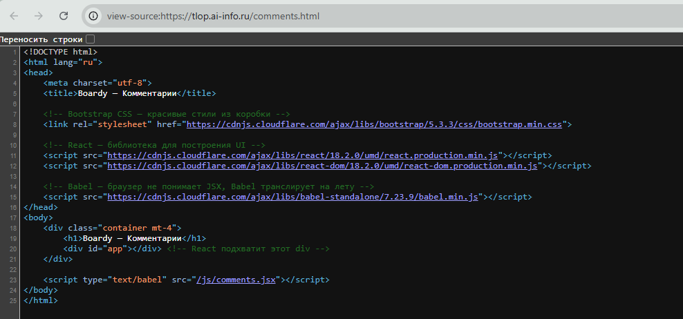
CSR - это рендеринг на стороне клиента(браузера). Данные загружаются после загрузки HTML-страницы, с помощью JavaScript. 
Поисковые боты (Google, Яндекс) видят то же, что и View Source, то есть ничего из динамически загруженного контента.

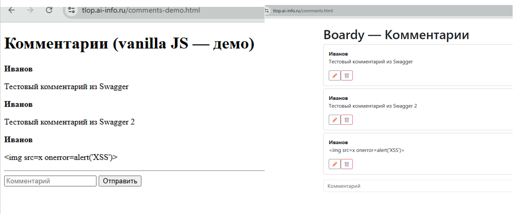
Vanilla JS защищается ручным экранированием через функцию esc(). React защищается автоматическим экранированием всех данных в {}(по умолчанию).
React надежней, потому что защита встроена по умолчанию, её нельзя забыть или пропустить.

|                            | SSR (PHP)           | vanilla JS                        | React            |
|----------------------------|---------------------|-----------------------------------|------------------|
| Кто рендерит HTML          | Сервер(PHP)         | Клиент(браузер)                   | Клиент(браузер)  |
| Формат ответа сервера      | Готовый HTML        | Пустой HTML + JS                  | Пустой HTML + JS |
| View Source: данные видны? | Да, весь HTML сразу | Да (но данные могут подгружаться) | Нет              |
| Перезагрузка при отправке  | Да                  | Можно без                         | Нет              |
| Защита от XSS              | htmlspecialchars    | Ручная (собственная esc())        | Автоматическая   |
| Сложность кода             | Низкая              | Средняя                           | Высокая          |

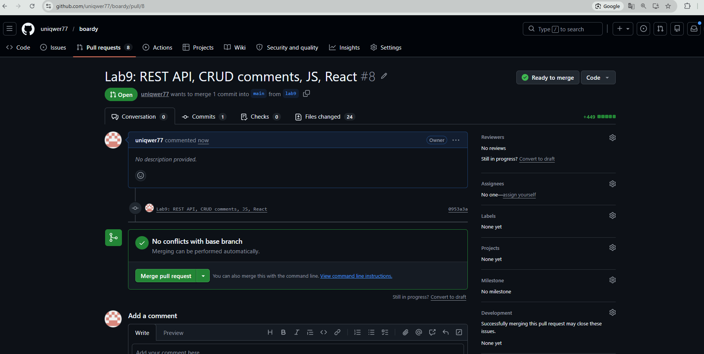
